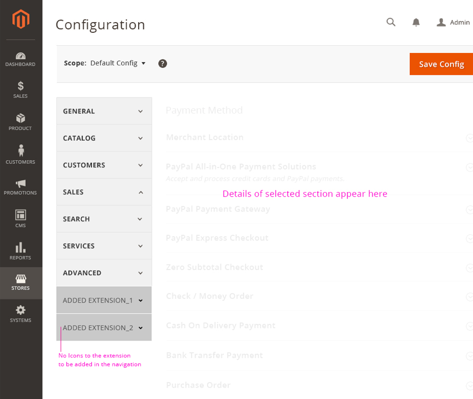
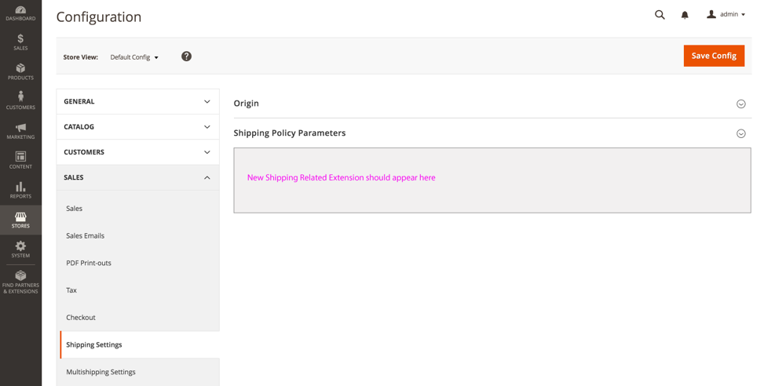
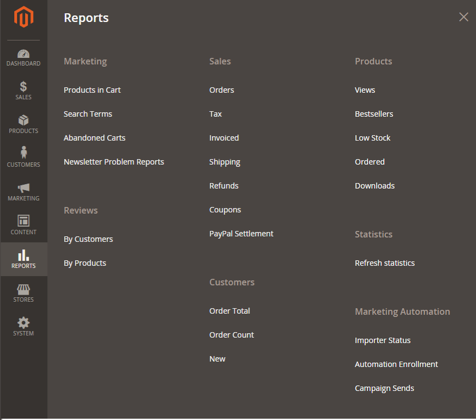
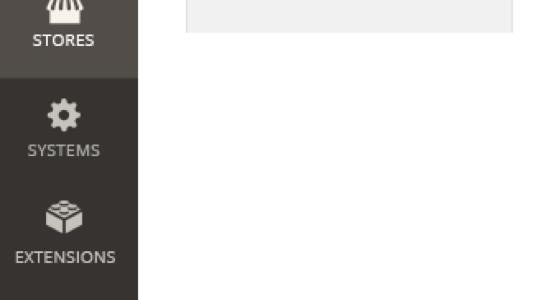

# Admin panel placement and design

The flexible Adobe Commerce and Magento Open Source framework lets you place an extension anywhere in the Admin panel. However, it can be difficult finding the right place for your extension and how it should look, so we've prepared the following guidelines to help.

## Things to Avoid

We discourage practices that diminish the user experience in the Admin. The following design decisions that have been seen in some extensions create a negative user experience and should be avoided.

### Icons in the primary navigation

Icons should not be added to the primary navigation panel in the Admin. If every extension added its own icon to the primary navigation panel, the interface will quickly become cluttered and unusable.

Icons should not be used in any of the navigation submenu panels to bring attention to your extension. Your navigation listing should conform to the look and feel of its surroundings and not look out of place.

Your extension's settings and configuration area is an appropriate place to use icons.

For more information about icon design and the application's icon library, see the article about  [Iconography](https://developer.adobe.com/commerce/admin-developer/style-guide/design/iconography/) in the Admin Style Guide book.

### Advertising in Navigation

It is not appropriate to use the Admin navigation for marketing or to cross-sell extensions after your extension has been installed. A [new section](#feature-extensions) is under proposal that will possibly be more suitable for marketing and advertising content.

Do not use the name of your company or marketing jargon as part of an extension name or the extension name itself in the Admin. You should create a unique feature name that users will understand because people usually search for extensions by feature or function keywords, not by a company or brand name.

## Placement guidelines for extension types

From the list of extension types below, determine the type of extension you have and read the guidance for placement and style.

*The names for the types of extensions listed below are for reference purposes only.*

### Standard Connector

These extensions provide additional APIs and are responsible for providing settings between the application and another system.

**Placement:**

All required settings for this connector type should appear in the **Stores** > Settings > **Configuration** section. The actual listings for these extension settings should appear after all of the application's listed settings. All the setting details and configurations should appear in the section to the right.

**Style:**

*  The style of the listing for your settings should match the look of the application's listed settings.
*  Icons or images should not be used in the navigation listing for your settings.

---

### Store Feature Connector

These extensions are responsible for integrating with different systems and need additional
settings displayed under specific entries in the **Store** > Settings > **Configuration** section.

**Placement:**

The settings for these extensions should be displayed under its respective parent section under the **Store** > Settings > **Configuration** section.

For example, if the extension is for Shipping, then you can place it under **Store** > Settings > **Configuration** > **Sales** > **Shipping Settings**.

---

### Connector with additional features

These extensions are responsible for integrating with different systems and need additional settings and configurations for synchronizing with these systems.

**Placement:**

If all the settings for an extension can be consolidated into one section, then the extension can be added to one of the primary navigation's submenu as links under the appropriate parent item. Avoid placing extension settings in multiple sections, such as the Configuration section and another related section.

For example, if your extension is related to the "Reports" functionality then its settings should appear as a link under the Report Section in the Primary navigation.

**Style:**

*  The styles of the links in the admin should follow the same styles of the default navigation links.
*  Do not introduce custom icons in the navigation submenus.

---

### Feature Extensions

These are extensions which provide additional functionality that do not already exist as a feature. These extensions usually demand an additional primary navigation item.

**Placement:**

There will be a new, dedicated section designed for such exclusive extensions. When feature-level extensions are installed, those extensions will live under this section. The exact final name of this new section has not been decided (we welcome your feedback), but in the image below it is named Extensions.

<InlineAlert variant="info" slots="text"/>

The name and icon for this section is still TBD. This new section is a future proposal, and we welcome feedback about if and how advertisements should be displayed here.

Since this section is not yet available, you should place your extension in one of the previously mentioned areas where it would be the most appropriate.

---

### Integrated Extensions

These are add-ons to existing features and might appear as a nested feature.

**Placement:**

As these are integrated features no direct/indirect accessible links are available from the admin.

---

### Codebase Extensions

These extensions are created as a code and do not need to have a representation in the admin panel.

**Placement:**

As these extensions do not have additional settings no direct/indirect accessible links are available from the admin.
