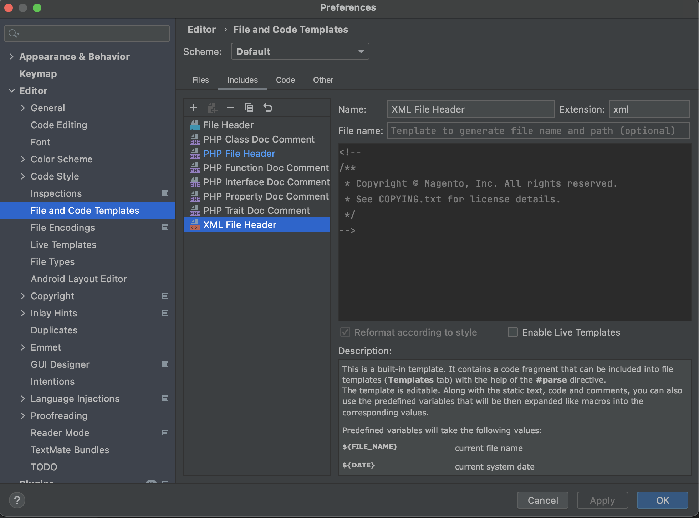
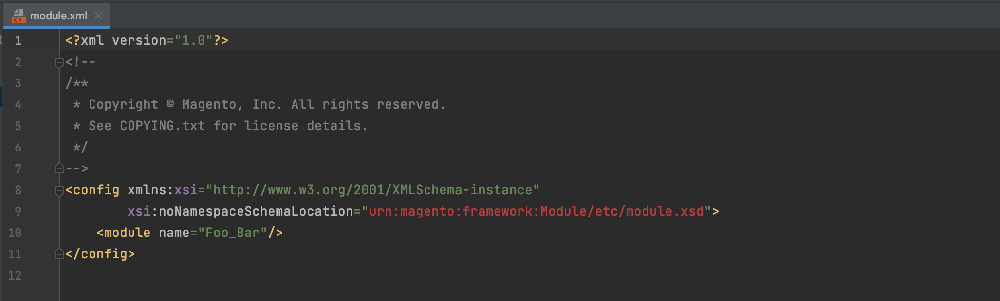
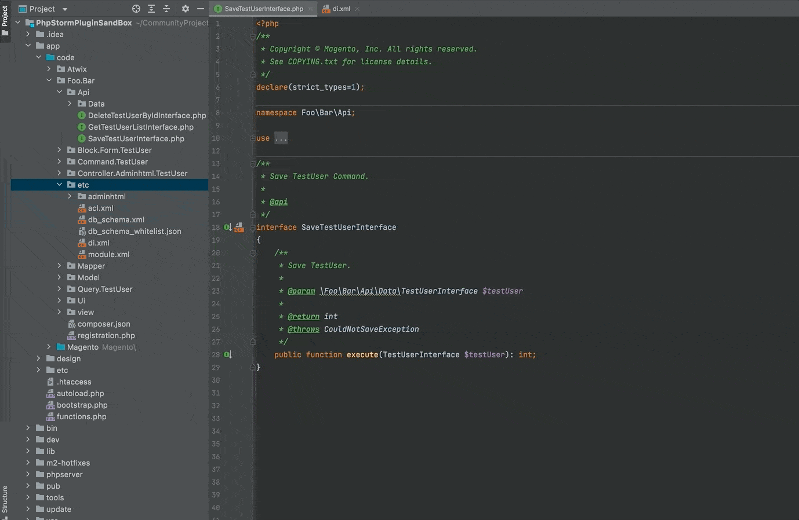
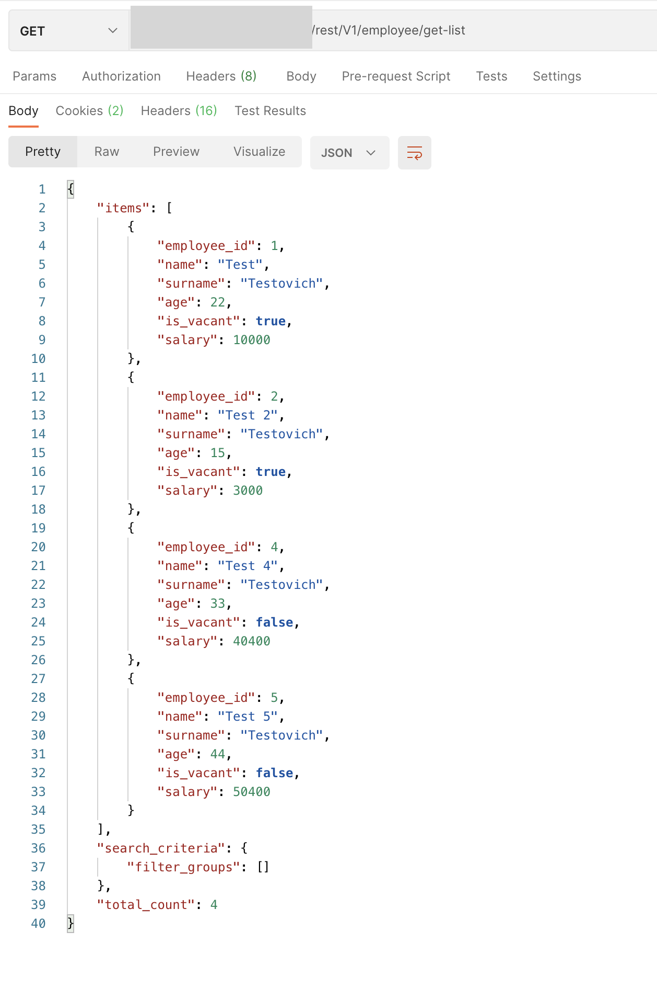
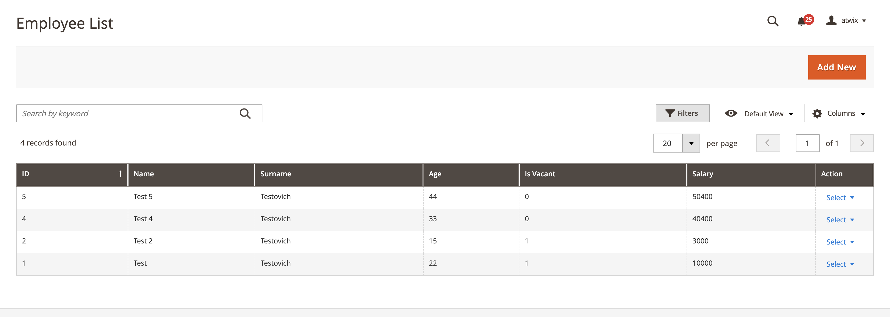

# Code generation

The PHPStorm plugin enables features and functionality to help you create custom extensions.

## XML file header

The **XML file header** template is located in the PHPStorm plugin menu, under **Preferences** > **Editor** > **File and Code Templates**.

You can configure the **XML file header** that appears in all generated XML files in the PHPStorm plugin GUI:

### Usage

All generated XML files will include the **XML file header**:

## Web API declaration generation

## Web API interface for service (PHP class) generation

## Web API generation for the Magento Entity Creator

From now on, the Entity Creator feature also includes the Web API generation.

There is an example of the output for generated entity when accessing get list REST API endpoint from the Postman application and from the admin panel in browser:

