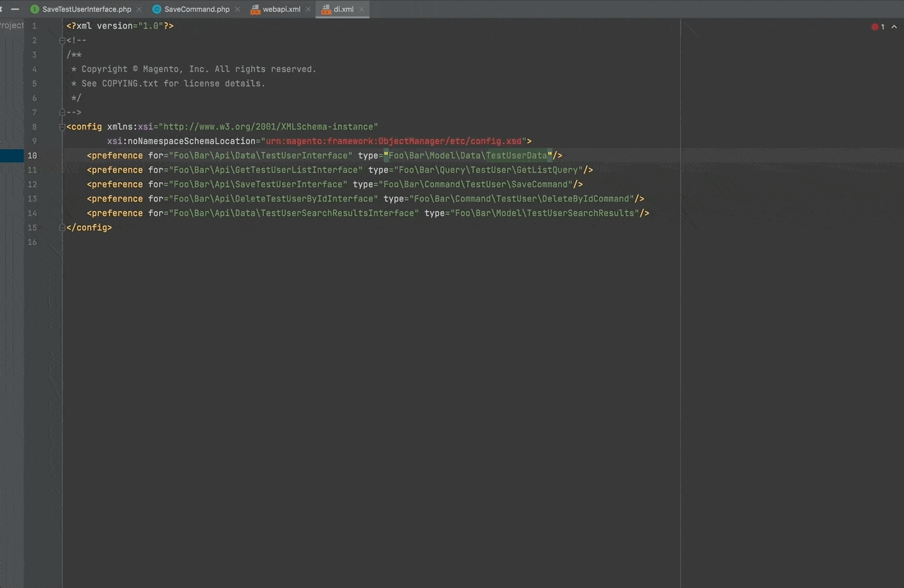
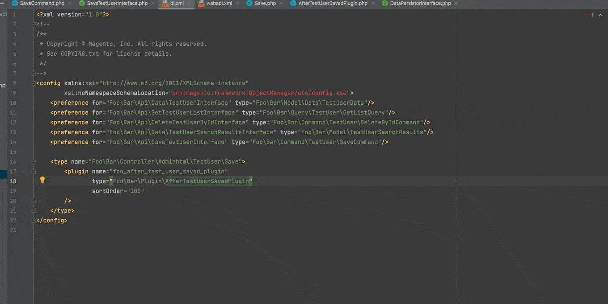

### Web API XML service tag attributes inspections

### DI XML preference tag attributes inspections

### DI XML type tag attributes inspections that related to the PHP/Magento types

The `Type` tag inspections (in the di.xml files) detect empty values or invalid values where a Type values (class, interface, virtual type) are expected.

It also supports recursive inspection for `xsi:type="array"` arguments.

### DI XML plugin type attribute inspections

