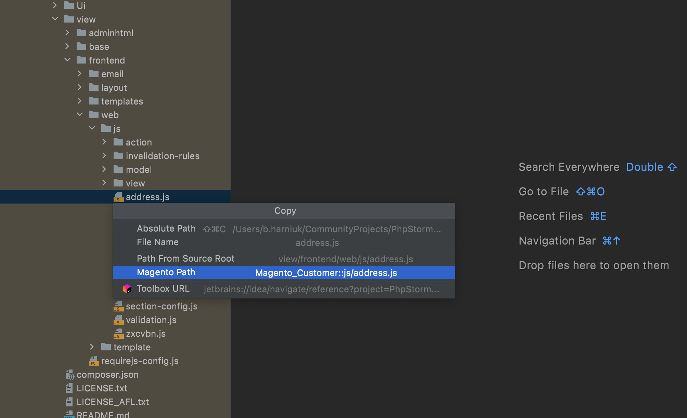
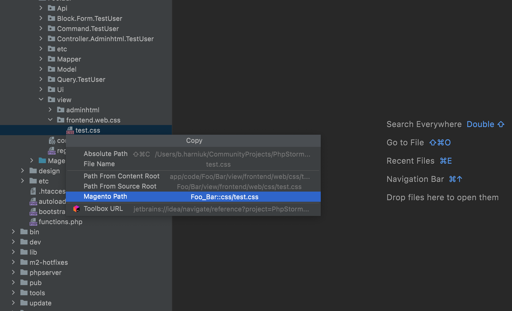
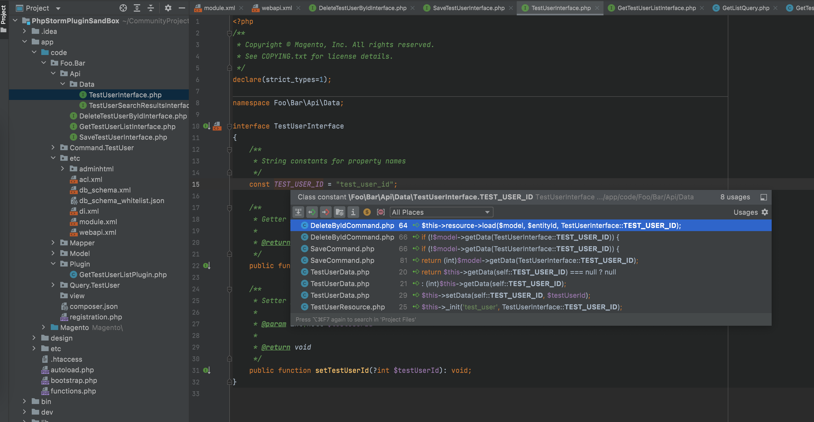

# Features

The following sections describe best practices for using the PHPStorm plugin.

## JS and CSS support for Copy Magento Path action

You can now copy the Magento Path for both JS and CSS files

For JS files:

For CSS files:

## Changed the content of the generated plugin class

## Use of hardcoded entity id value into the constant in all files generated by the Entity Creator

