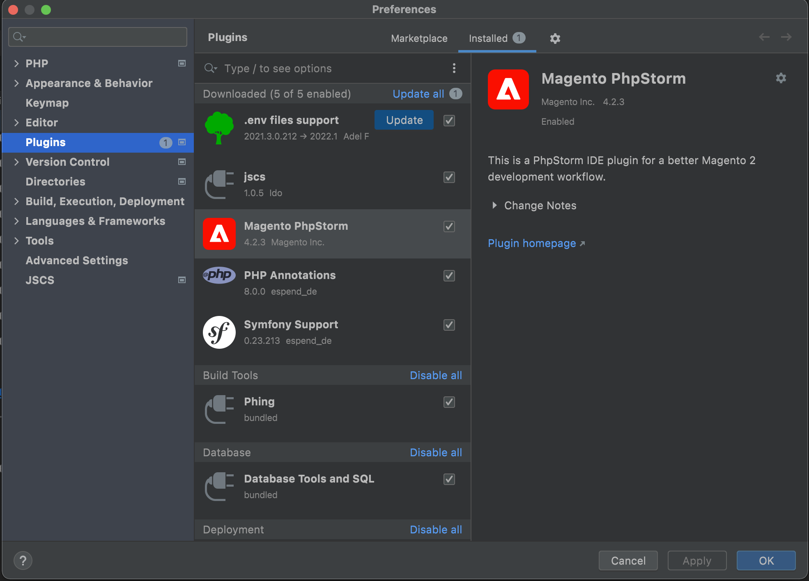
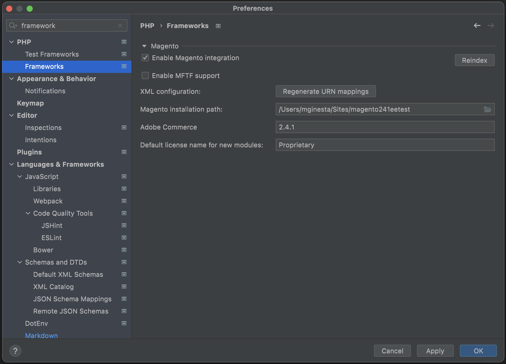

# Install

To install the Magento PHPStorm plugin:

*  Download the plugin from the [PHPStorm Marketplace](https://plugins.jetbrains.com/plugin/8024-magento-phpstorm).

   

*  Or alternatively, you can install it from your PHPStorm screen. Navigate to **Preferences** > **Plugins** and select Magento PHPStorm.

   

After the installation, it is necessary to enable the integration with Magento:

1. Go to **Preferences** > **Frameworks**.
1. Select the **Enable Magento Integration** checkbox. See [Install PHPStorm plugin](https://github.com/magento/magento2-phpstorm-plugin#installation) topic for more information.

You also need to provide:

*  Adobe Commerce or Magento Open Source installation path
*  Adobe Commerce or Magento Open Source version (for example, `2.4.4`)
*  Default license name for new modules (by default, `Proprietary`)

See the video tutorial [Using the Upgrade Compatibility Tool on PHP Storm](https://experienceleague.adobe.com/docs/commerce-learn/tutorials/upgrade/uct-phpstorm.html?lang=en) page for more information about the PHPStorm plugin.
