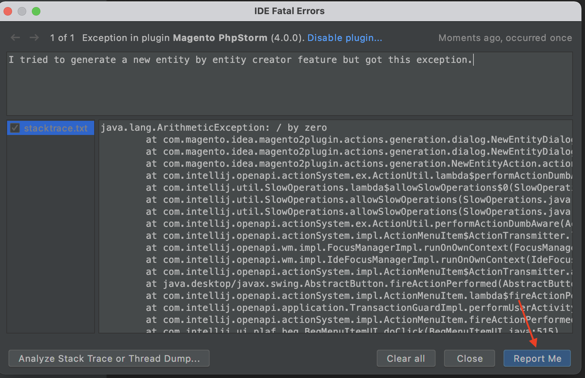
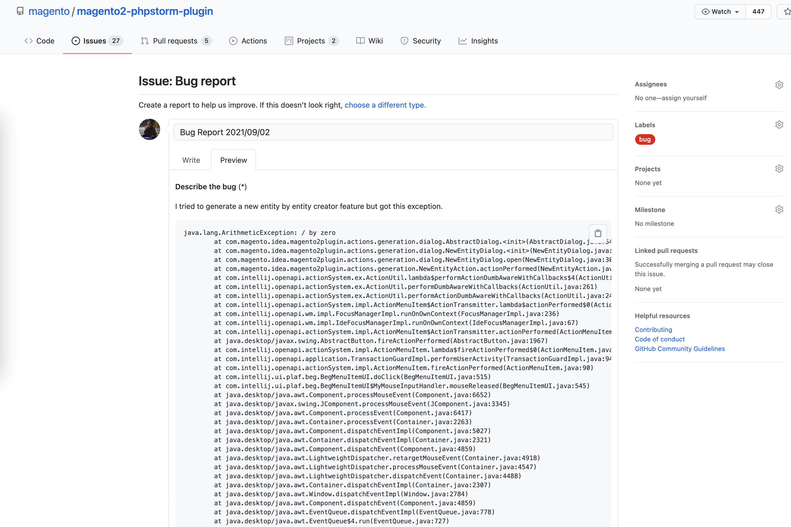
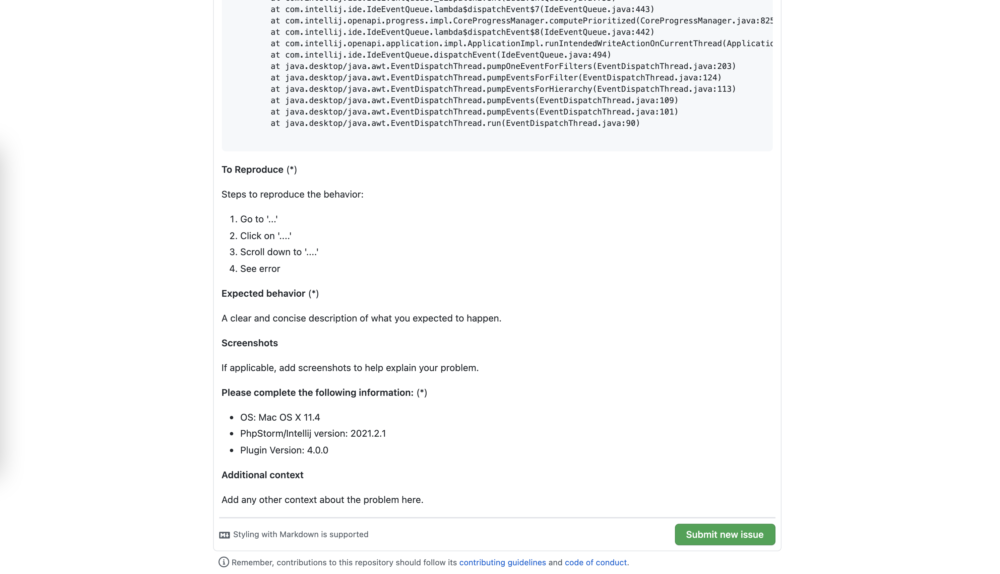

# Issue reporting

There is now an extension point for the errorHandler to integrate the plugin with the IDE's dialog to report fatal errors.

*  When an issue occurred click on the `See details and submit report` link for reporting an issue.

*  Fill the issue description and click on the `Report Me` button:

*  Change the auto generated issue title to the proper one:

*  Fill the rest with available information about an issue (such as steps to reproduce, expected behaviour etc.) and click on the `Submit new issue` button:

