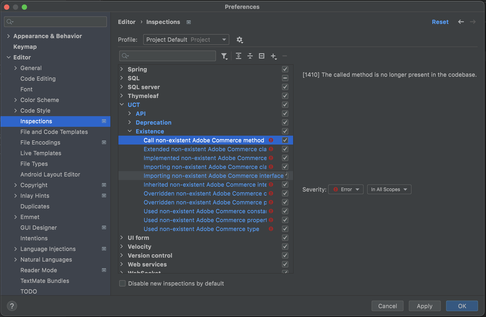
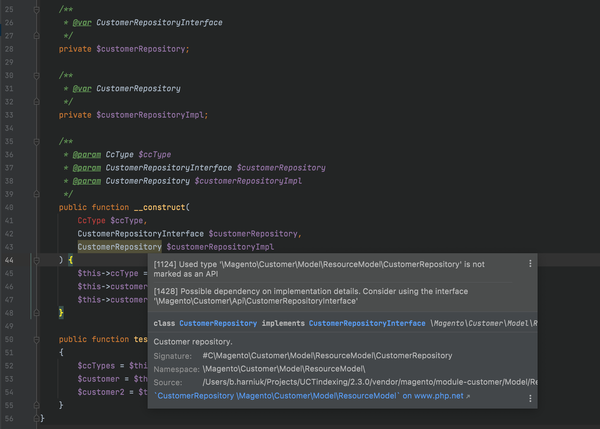
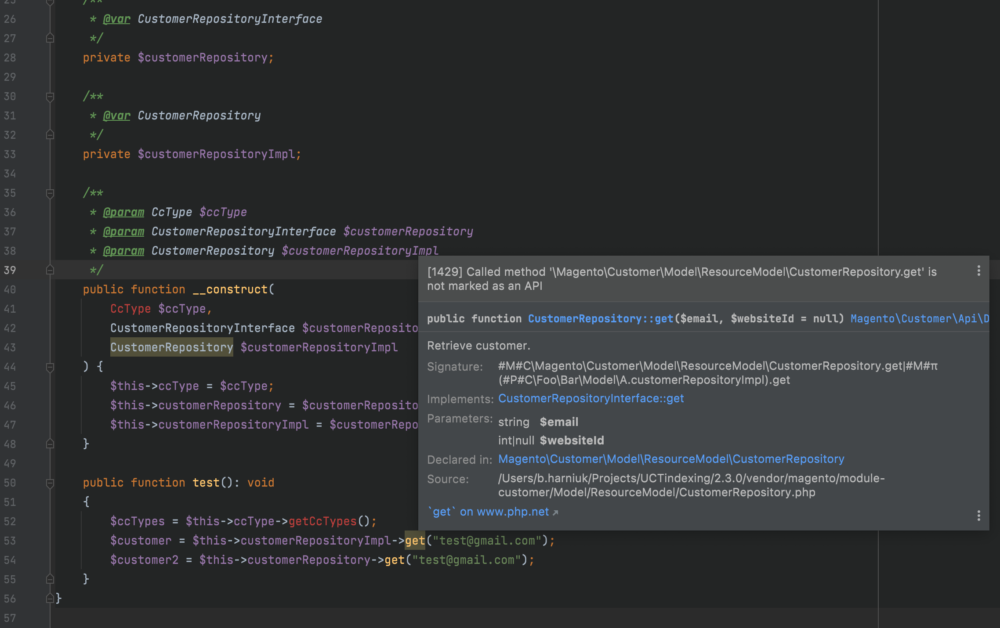
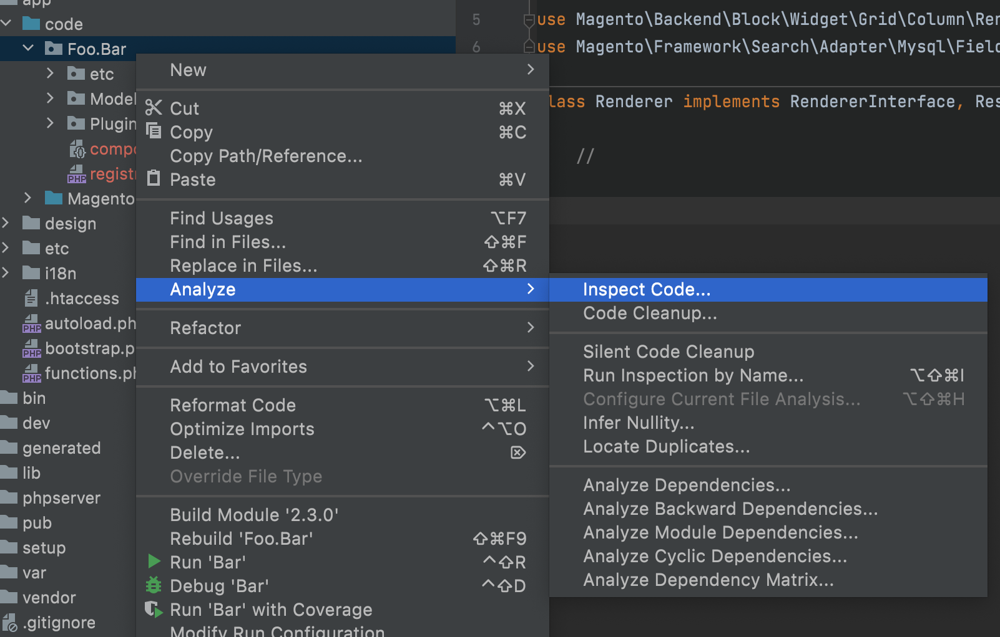
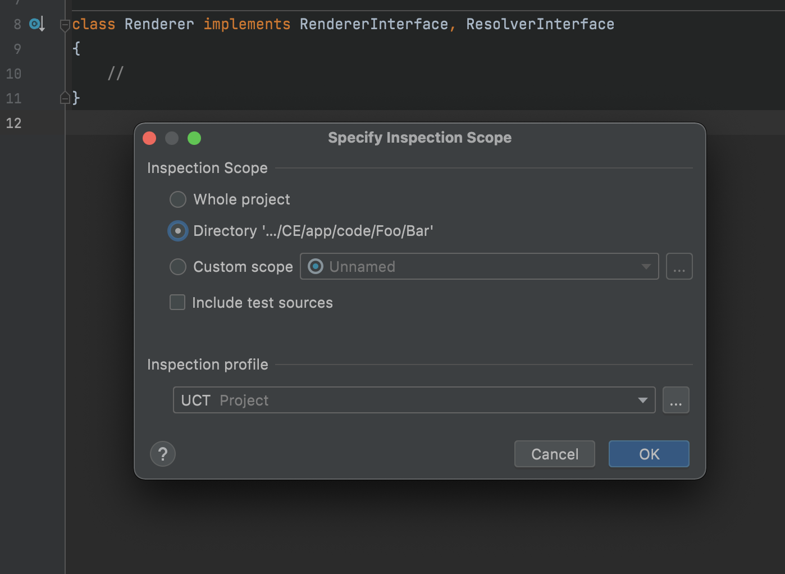
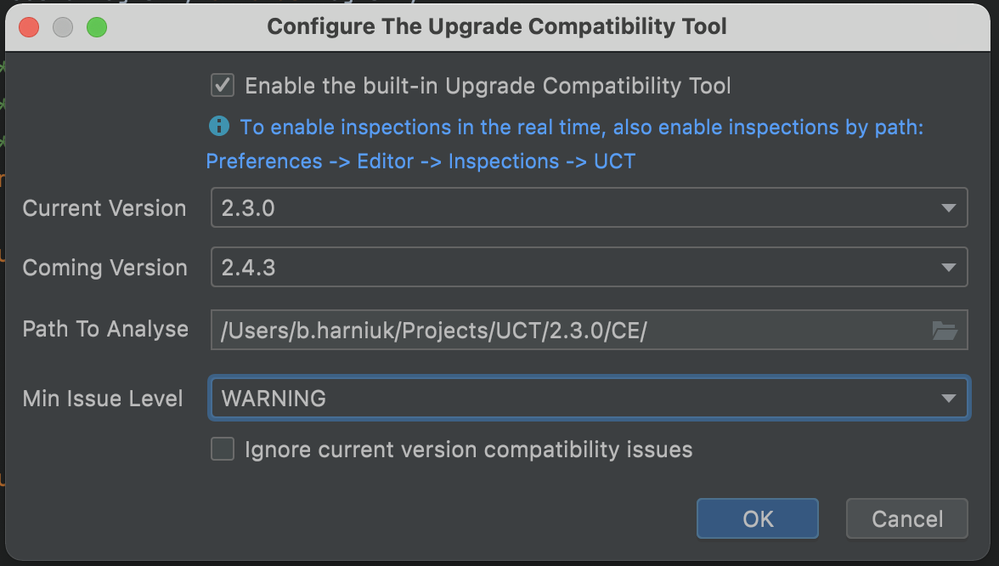

# Built-in Upgrade Compatibility Tool

The built-in Upgrade Compatibility Tool aims to achieve the same issues coverage as original Adobe Commerce [Upgrade Compatibility Tool](https://experienceleague.adobe.com/docs/commerce-operations/upgrade-guide/upgrade-compatibility-tool/overview.html).
There are three types of inspections covered by this MVP version:

*  Deprecation (severity level: WARNING)
*  API coverage (severity level: ERROR)
*  Existence (severity level: CRITICAL)

A complete list of inspections that are already available in the original tool, can be found by the [following link](https://experienceleague.adobe.com/docs/commerce-operations/upgrade-guide/upgrade-compatibility-tool/error-messages.html).

This feature can be used in three different ways, from the user's point of view:

*  Run compatibility inspections in a [run tool window](https://www.jetbrains.com/help/idea/run-tool-window.html), with the familiar output, as in the original Adobe Commerce [Upgrade Compatibility Tool](https://experienceleague.adobe.com/docs/commerce-operations/upgrade-guide/upgrade-compatibility-tool/overview.html)
*  Run inspections in real time, on the files that are opened in the editor (default)
*  [Run inspections manually](https://www.jetbrains.com/help/idea/running-inspections.html) through the user interface on the selected scope of files (default)

It was developed with an aim to use IntelliJ IDEA in the most effective way. So, inspections that are running during
the code analysis can alternatively be enabled in the [inspections settings](https://www.jetbrains.com/help/idea/code-inspection.html)
`Preferences -> Editor -> Inspections -> UCT`:

It allows you to see the problematic code just in real time, without running it intentionally during code writing or file viewing.
**The result of the real time inspection is most suitable for use during development, to be always compatible with future versions**:

The second IntelliJ IDEA tool that we can use for running UCT inspections is called **Inspect Code**. It is available under menu item
`Code -> Inspect Code`. Also, you can open a context menu under the target directory that allows IntelliJ IDEA to populate the path to analyse for you automatically:

By calling the **Inspect Code** action from the context menu, the Inspection Scope will be populated for us automatically.
The last thing to configure here is **Inspection Profile**.
By default, there will be the **Project Default** profile with all inspections that are not connected to our goal.

You can create a new profile with the only UCT inspections enabled (for further information [read here](https://www.jetbrains.com/help/idea/customizing-profiles.html)):

For this inspection type you do not need to have UCT inspections enabled for your project.
**The result of this inspection is most suitable for code refactoring when eliminating problematic code**:

**The most powerful inspection type is the execution of compatibility inspections in a [run tool window](https://www.jetbrains.com/help/idea/run-tool-window.html) with the familiar output as in the original Adobe Commerce [Upgrade Compatibility Tool](https://experienceleague.adobe.com/docs/commerce-operations/upgrade-guide/upgrade-compatibility-tool/overview.html)**.

**Advantages from using this inspection:**

*  All problems are gathered in one place
*  There are links to the problem files, a stored report in json format, links to the web page with detailed descriptions of all the error codes
*  This report can be easily used from the merchant, management or agency side
*  There is a complexity score that helps measure the upgrade complexity

Before using it, you should configure the built-in UCT in a same way to the CLI Run Configuration.
All fields, as above, are described in the Upgrade Compatibility Tool Run Configuration section and are more detailed
in the [official documentation](https://experienceleague.adobe.com/docs/commerce-operations/upgrade-guide/upgrade-compatibility-tool/run.html).

Go to the UCT configuration dialog `Tools -> Configure The Upgrade Compatibility Tool` and configure it as required:

After this, you can run this tool at any time you require by using `Tools -> Run The Upgrade Compatibility Tool`:

For this inspection type you do not need to have UCT inspections enabled for your project, but it is easier to see the problems in the file
after navigating to it.

<InlineAlert variant="warning" slots="text"/>

**Keep in mind**, that for all inspection types the target version (coming version) is configured
in the built-in UCT configuration dialog `Tools -> Configure The Upgrade Compatibility Tool`.
This is also applicable for the other selected configurations on the screenshot below:

