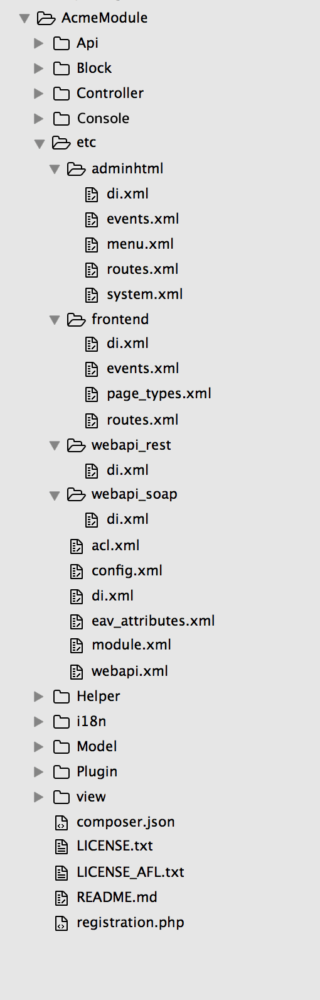

# Create your component file structure

In this section, we go over the different file structures for the component types. The Magento application looks for the files that make up a component *including configuration files* in particular places inside the component file structure. Follow the predefined file structures for the component type you are developing to ensure that it works as expected.

## Root directory location

import Docs from '/src/pages/_includes/component-root.md'

<Docs />

## Module file structure

A typical file structure for a Magento 2 [module](https://glossary.magento.com/module) can look like the following:



### Common directories

Following are some common module directories:

*  `Block`: contains [PHP](https://glossary.magento.com/php) view classes as part of Model View Controller(MVC) vertical implementation of module logic.
*  `Controller`: contains PHP controller classes as part of MVC vertical implementation of module logic.
*  `etc`: contains configuration files; in particular, `module.xml`, which is required.
*  `Model`: contains PHP model classes as part of MVC vertical implementation of module logic.
*  `Setup`: contains classes for module database structure and data setup which are invoked when installing or upgrading.
*  `ViewModel`: contains PHP model classes as part of a model-view-viewmodel (MVVM) implementation. It allows developers to offload features and business logic from block classes into separate classes that are easier to maintain, test, and reuse.

### Additional directories

Additional folders can be added for configuration and other ancillary functions for items like [plugin-ins](../components/plugins.md), localization, and [layout](https://glossary.magento.com/layout) files.

*  `Api`: contains any PHP classes exposed to the [API](https://glossary.magento.com/api).
*  `Console`: contains CLI commands. For more info, see [Add CLI commands](../cli-commands/create-new.md).
*  `Cron`: contains cron job definitions.
*  `CustomerData`: contains section files.
*  `Helper`: contains aggregated functionality.
*  `i18n`: contains localization files.
*  `Observer`: contains files for executing commands from the listener.
*  `Plugin`: contains any needed [plug-ins](../components/plugins.md).
*  `UI`: contains data generation files.
*  `view`: contains view files, including static view files, design templates, email templates, and layout files.

## Theme file structure

A typical [theme](https://glossary.magento.com/theme) file structure can look like the following:

```tree
├── composer.json
├── etc
│   └── view.xml
├── i18n
│   └── en_US.csv
├── LICENSE_AFL.txt
├── LICENSE.txt
├── media
│   └── preview.jpg
├── registration.php
└── web
    ├── css
    │   ├── email.less
    │   ├── print.less
    │   ├── source
    │   │   ├── _actions-toolbar.less
    │   │   ├── _breadcrumbs.less
    │   │   ├── _buttons.less
    │   │   ├── components
    │   │   │   └── _modals_extend.less
    │   │   ├── _icons.less
    │   │   ├── _layout.less
    │   │   ├── _theme.less
    │   │   ├── _tooltips.less
    │   │   ├── _typography.less
    │   │   └── _variables.less
    │   ├── _styles.less
    │   ├── styles-l.less
    │   └── styles-m.less
    ├── images
    │   └── logo.svg
    └── js
        ├── navigation-menu.js
        └── theme.js
```

### Common directories

Typical theme directories are:

*  `etc`: Contains configuration files such as the `view.xml` file which contains image configurations for all images and thumbnails.
*  `i18n`: [Translation dictionaries](https://devdocs.magento.com/guides/v2.4/frontend-dev-guide/translations/xlate.html#m2devgde-xlate-dictionaries), if any.
*  `media`: Theme preview images (screen capture of your theme) can be put in here.
*  `web`: Optional directory that contains [static files](https://glossary.magento.com/static-files) organized into the following subdirectories:

   *  `css/source`: Contains a theme's `less` configuration files that invoke mixins for global elements from the [Magento UI library](https://devdocs.magento.com/guides/v2.4/frontend-dev-guide/css-topics/theme-ui-lib.html), and the `theme.less` file that overrides the default variables values.
   *  `css/source/lib`: Contains view files that override the [UI library](https://devdocs.magento.com/guides/v2.4/frontend-dev-guide/css-topics/theme-ui-lib.html) files stored in `lib/web/css/source/lib`.
   *  `fonts`: The folder to place the different fonts for your theme.
   *  `images`: Static images folder.
   *  `js`: The folder for your JavaScript files.

For more details on the theme folder structure, see [Magento theme structure](https://devdocs.magento.com/guides/v2.4/frontend-dev-guide/themes/theme-structure.html).

### Language package file structure

A typical directory structure for three language packages follows:

```tree
├── de_DE
│   ├── composer.json
│   ├── language.xml
│   ├── LICENSE_AFL.txt
│   ├── LICENSE.txt
│   └── registration.php
├── en_US
│   ├── composer.json
│   ├── language.xml
│   ├── LICENSE_AFL.txt
│   ├── LICENSE.txt
│   └── registration.php
├── pt_BR
│   ├── composer.json
│   ├── language.xml
│   ├── LICENSE_AFL.txt
│   ├── LICENSE.txt
│   └── registration.php
```

The only required directory for a language package is the top-level directory. Although not required, we recommend that the directory name match the [ISO](http://www.iso.org/iso/home/standards/language_codes.htm) code to identify the locale.

For more information about language packages, see [Translation dictionaries and language packages](https://devdocs.magento.com/guides/v2.4/config-guide/cli/config-cli-subcommands-i18n.html).
