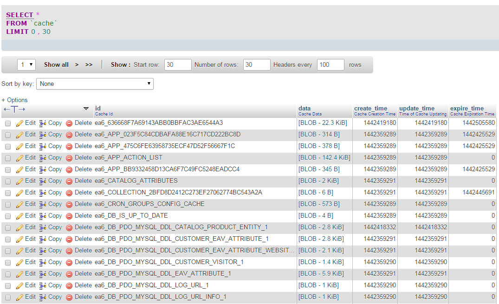
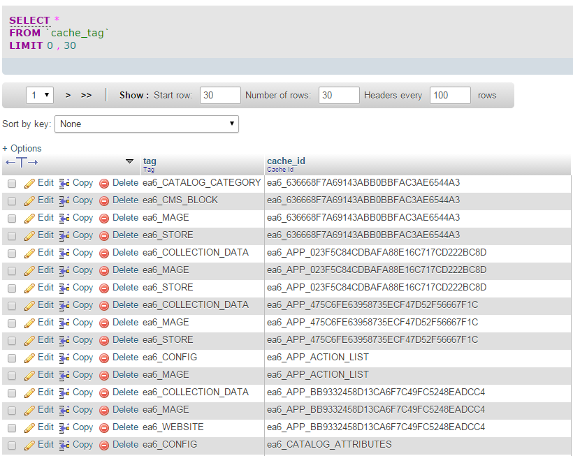

# Create custom cache engines

This topic discusses how to use the database for caching. After you complete these tasks, cached objects are stored in the `cache` and `cache_tag` database tables. Nothing is stored `var/cache` or `var/page_cache`.

This topic discusses how to set up database caching and how to verify database caching is working. We discuss the following options:

*  Using the `default` cache frontend, in which case you modify `di.xml` only.
*  Using a custom [cache](https://glossary.magento.com/cache) frontend, in which case you modify `env.php` only.

<InlineAlert variant="warning" slots="text"/>

Database caching---like file-based caching--- works well in a development environment but we _strongly recommend_ you use [Varnish] in production instead.
Varnish is designed to accelerate the HTTP protocol.

## Prerequisites

Before you continue, if you're using your own frontend cache, make sure you [associate cache frontends with cache types]. If you're using the `default` [frontend](https://glossary.magento.com/frontend) cache, you don't have to do that.

We provide [sample configurations] at the end of this topic.

## Database caching using the `default` cache frontend

To enable database caching using the `default` frontend, you must modify the `<magento_root>/app/etc/di.xml` file, which is the global deployment injection configuration for the application.

To modify `di.xml`:

1. Log in to the application server as, or switch to, the [file system owner].
1. Enter the following commands to make a copy of `di.xml`:

   ```bash
   cd <magento_root>/app/etc
   ```

   ```bash
   cp di.xml di.xml.bak
   ```

1. Open `di.xml` in a text editor and locate the following block:

   ```xml
   <type name="Magento\Framework\App\Cache\Frontend\Pool">
       <arguments>
           <argument name="frontendSettings" xsi:type="array">
               <item name="page_cache" xsi:type="array">
                   <item name="backend_options" xsi:type="array">
                       <item name="cache_dir" xsi:type="string">page_cache</item>
                   </item>
               </item>
           </argument>
       </arguments>
   </type>
   <type name="Magento\Framework\App\Cache\Type\FrontendPool">
       <arguments>
           <argument name="typeFrontendMap" xsi:type="array">
               <item name="full_page" xsi:type="string">page_cache</item>
           </argument>
       </arguments>
   </type>
   ```

   The `<type name="Magento\Framework\App\Cache\Frontend\Pool">` node configures options for the in-memory pool of all frontend cache instances.

   The `<type name="Magento\Framework\App\Cache\Type\FrontendPool">` node configures cache frontend options specific to each cache type.

1. Replace the entire block with the following:

   ```xml
   <type name="Magento\Framework\App\Cache\Frontend\Pool">
       <arguments>
           <argument name="frontendSettings" xsi:type="array">
               <item name="page_cache" xsi:type="array">
                   <item name="backend" xsi:type="string">database</item>
               </item>
               <item name="<your cache id>" xsi:type="array">
                   <item name="backend" xsi:type="string">database</item>
               </item>
           </argument>
       </arguments>
   </type>
   <type name="Magento\Framework\App\Cache\Type\FrontendPool">
       <arguments>
           <argument name="typeFrontendMap" xsi:type="array">
               <item name="backend" xsi:type="string">database</item>
           </argument>
       </arguments>
   </type>
   ```

   where `<your cache id>` is your unique cache identifier.

1. Save your changes to `di.xml` and exit the text editor.

1. Continue with [Verify database caching is working].

## Database caching using a custom cache frontend

This section discusses how to set up database caching with a custom [cache frontend](https://glossary.magento.com/cache-frontend).

<InlineAlert variant="info" slots="text"/>

Due to a known issue, a custom cache frontend still results in some objects being cached to the file system; however, fewer assets are cached compared to file system caching.

To enable database caching using a custom cache frontend, you must modify `<magento_root>/app/etc/env.php` as follows:

1. Log in to the application server as, or switch to, the [file system owner].
1. Enter the following commands to make a copy of `env.php`:

   ```bash
   cd <magento_root>/app/etc
   ```

   ```bash
   cp env.php env.php.bak
   ```

1. Open `env.php` in a text editor and add the following anywhere, such as before `'cache_types' =>`:

   ```php
   'cache' => [
       'frontend' => [
           '<unique frontend id>' => [
                <cache options>
           ],
       ],
       'type' => [
            <cache type 1> => [
                'frontend' => '<unique frontend id>'
           ],
       ],
       'type' => [
            <cache type 2> => [
               'frontend' => '<unique frontend id>'
           ],
       ],
   ],
   ```

   An example is shown in [Configuration examples].

1. Save your changes to `env.php` and exit the text editor.
1. Continue with the next section.

## Verify database caching is working

To verify database caching is working, clear the current cache directories, go to any cacheable page in a web browser, and verify that data is written to the database and not to the file system.

Use the following steps:

1. If you haven't done so already, log in to the application server as, or switch to, the [file system owner].
1. Clear the current cache directories:

   ```bash
   rm -rf <magento_root>/var/cache/* <magento_root>/var/page_cache/* <magento_root>/generated/metadata/* <magento_root>/generated/code/*
   ```

1. In a web browser, go to any cacheable page (such as the [storefront](https://glossary.magento.com/storefront) front door page).

   If exceptions display, verify `di.xml` syntax and try again. (To see exceptions in the browser, you must [enable developer mode].)

1. Enter the following commands:

   ```bash
   ls <magento_root>/var/cache/*
   ```

   ```bash
   ls <magento_root>/var/page_cache/*
   ```
  
   Due to a known issue, a custom cache frontend still results in some objects being cached to the file system; however, fewer assets are cached compared to file system caching. If you use the `default` cache frontend, you don't have this issue.

1. Verify both directories are empty; if not, edit `di.xml` again and correct any issues.
1. Use a database tool such as [phpMyAdmin] to verify there is data in the `cache` and `cache_tag` tables.

   The following figures show examples. The important thing is that there are rows in the tables. _The data in your tables will be different than the following_.

   `cache` table example.

   

   `cache_tag` table example.

   

## Configuration examples

This section contains code sample snippets to refer to when configuring database caching.

### Sample `di.xml` for the default cache frontend

`di.xml` snippet:

```xml
<type name="Magento\Framework\App\Cache\Frontend\Pool">
    <arguments>
        <argument name="frontendSettings" xsi:type="array">
            <item name="page_cache" xsi:type="array">
                <item name="backend" xsi:type="string">database</item>
            </item>
            <item name="default" xsi:type="array">
                <item name="backend" xsi:type="string">database</item>
            </item>
        </argument>
    </arguments>
</type>
<type name="Magento\Framework\App\Cache\Type\FrontendPool">
    <arguments>
        <argument name="typeFrontendMap" xsi:type="array">
            <item name="backend" xsi:type="string">database</item>
        </argument>
    </arguments>
</type>
```

### Sample `env.php` for a custom cache frontend

`env.php` snippet that enables all cache types with a custom frontend named `magento_cache`:

```php
'cache' => [
    'frontend' => [
        'magento_cache' => [
            'backend' => 'database'
        ],
    ],
    'type' => [
        'config' => [
            'frontend' => 'magento_cache'
        ],
        'layout' => [
            'frontend' => 'magento_cache'
        ],
        'block_html' => [
            'frontend' => 'magento_cache'
        ],
        'view_files_fallback' => [
            'frontend' => 'magento_cache'
        ],
        'view_files_preprocessing' => [
            'frontend' => 'magento_cache'
        ],
        'collections' => [
            'frontend' => 'magento_cache'
        ],
        'db_ddl' => [
            'frontend' => 'magento_cache'
        ],
        'eav' => [
            'frontend' => 'magento_cache'
        ],
        'full_page' => [
            'frontend' => 'magento_cache'
        ],
        'translate' => [
            'frontend' => 'magento_cache'
        ],
        'config_integration' => [
            'frontend' => 'magento_cache'
        ],
        'config_integration_api' => [
            'frontend' => 'magento_cache'
        ],
        'config_webservice' => [
            'frontend' => 'magento_cache'
        ],
    ],
],
```

<!-- Link references -->
[Varnish]: https://devdocs.magento.com/guides/v2.4/config-guide/varnish/config-varnish.html
[associate cache frontends with cache types]: https://devdocs.magento.com/guides/v2.4/config-guide/cache/cache-types.html
[sample configurations]: #configuration-examples
[file system owner]: https://devdocs.magento.com/guides/v2.4/install-gde/prereq/file-sys-perms-over.html
[Verify database caching is working]: #verify-database-caching-is-working
[Configuration examples]: #configuration-examples
[enable developer mode]: https://devdocs.magento.com/guides/v2.4/config-guide/cli/config-cli-subcommands-mode.html#change-to-developer-mode
[phpMyAdmin]: https://devdocs.magento.com/guides/v2.4/install-gde/prereq/optional.html#install-optional-phpmyadmin
