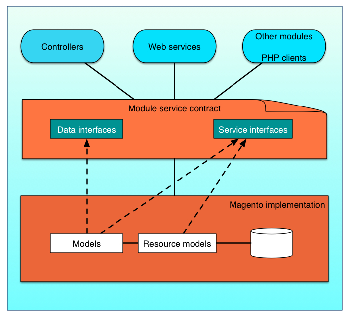

Magento is a modular system that enables third-party developers to customize and overwrite core parts of its framework. This flexibility, however, comes at a price. Business logic tends to leak across the layers of the Magento system, which manifests as duplicated and inconsistent code.

Merchants might be reluctant to upgrade Magento because customized extensions that they have purchased might not be compatible with new versions of Magento. Also, Magento and third-party developers can find it difficult to track and report the dependencies that customized extensions have on other extensions.

To address these issues, the Magento system introduces _service contracts_.

## What is a service contract? {#what-is-msc}

A [service contract](https://glossary.magento.com/service-contract) is a set of [PHP](https://glossary.magento.com/php) interfaces that are defined for a [module](https://glossary.magento.com/module).
A service contract includes [data interfaces](design-patterns.md#data-interfaces), which preserve data integrity, and [service interfaces](design-patterns.md#service-interfaces), which hide business logic details from service requestors such as controllers, web services, and other modules.

If developers define data and service interfaces according to a set of [design patterns](design-patterns.md), the result is a well-defined, durable [API](https://glossary.magento.com/api) that other modules and third-party extensions can implement through Magento models and resource models.

## Service contract benefits {#msc-benefits}

Service contracts enhance the modularity of Magento. They enable Magento and third-party developers to report system dependencies through `composer.json` files and, consequently, guarantee compatibility among Magento versions. This compatibility ensures that merchants can easily upgrade Magento.
These contracts ensure a well-defined, durable API that other modules and third-party extensions can implement. Also, these contracts make it easy to [configure services as web APIs](../web-api/services.md).

Data entities are a side benefit of service contracts.
The database tables that normally support these entities can be complicated.
For example, some attributes might be stored in an EAV table, so a set of MySQL database tables might define a single data [entity](https://glossary.magento.com/entity).
Data entities in a service contract reveal a simpler data model than the data model in an underlying relational [database schema](https://glossary.magento.com/database-schema).
Eventually, you will be able to use different storage technologies for different data collections. For example, you could use a NoSQL database to replace product tables.

## Using the @api tag

Backward compatibility can be indicated by the use of `@api`. For more information, see [Backward compatibility](https://developer.adobe.com/commerce/contributor/guides/code-contributions/backward-compatibility-policy/).

{:.ref-header}
Related topics

-  [Service contract design patterns](design-patterns.md)
-  [Configure services as webAPIs](../web-api/services.md)
