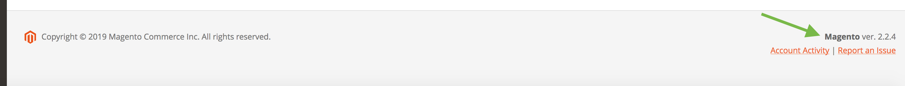

# Check the Commerce version

Use any of the following ways to determine which version of Adobe Commerce or Magento Open Source is installed:

-  From the command line
-  With an HTTP GET request
-  From within the Admin
-  By viewing the `composer.lock` file

## Command line

The following command returns the application version.

**Command:**

```bash
bin/magento --version
```

**Response:**

```terminal
Magento CLI version 2.4.0
```

## HTTP GET request

An HTTP request returns less detailed information about the application version.

**Request:**

```text
http://<magento2-store>/magento_version
```

**Response:**

```text
Magento/2.3 (Community)
```

## Admin

Log in as a registered Admin user. The application version is displayed at the bottom right of the page, above the  **Account Activity** and **Report an Issue** links:



## The `composer.lock` file

If the application was installed using the `composer install` command, you can search the `<Application_root>/composer.lock` file for `magento/product-community-edition` or `magento/product-enterprise-edition`, depending on which version of the application is installed.

```json
  {
    "name": "magento/product-community-edition",
    "version": "2.4.0",
```
