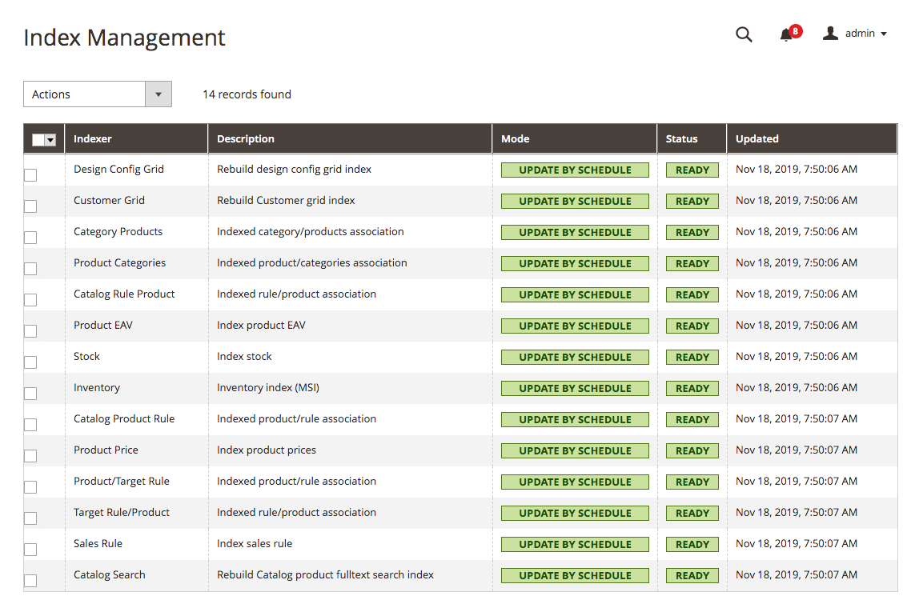

# Indexing

Indexing is how Adobe Commerce and Magento Open Source transform data such as products and categories, to improve the performance of your storefront. As data changes, the transformed data must be updated or reindexed. The application has a very sophisticated architecture that stores lots of merchant data (including catalog data, prices, users, and stores) in many database tables. To optimize storefront performance, the application accumulates data into special tables using indexers.

For example, if you change the price of an item from $4.99 to $3.99. the application must reindex the price change to display it on your storefront.

Without indexing, the application would have to calculate the price of every product on the fly, taking into account shopping cart price rules, bundle pricing, discounts, tier pricing, etc. Loading the price for a product would take a long time, possibly resulting in cart abandonment.

## Indexing terminology

Dictionary
: Original data entered to the system. Dictionaries are organized in <a href="https://en.wikipedia.org/wiki/Database_normalization" target="_blank">normal form</a> to facilitate maintenance (updating the data).

Index
: Representation of the original data for optimized reading and searching. Indexes can contain results of aggregations and various calculations. Index data can be always re-created from a dictionary using a certain algorithm.

Indexer
: Object that creates an index.

### Create custom indexers

Adobe Commerce and Magento Open Source contain several indexers out of the box, but you might want to add your own if your customization requires data searches, which are not optimized by the default indexers.

This topic provides a high level description of how indexing is implemented from a developer's point of view, and practical advice for how to add your own indexer.

## How the application implements indexing

The following components are involved in the indexing process:

| Component                                                                                                    | Description                                                                                                                                                                                                                                                                                                                       |
|--------------------------------------------------------------------------------------------------------------|-----------------------------------------------------------------------------------------------------------------------------------------------------------------------------------------------------------------------------------------------------------------------------------------------------------------------------------|
| [Magento_Indexer](https://github.com/magento/magento2/tree/2.4/app/code/Magento/Indexer)                     | Implements the following<ul><li>indexer declaration</li><li>indexer running</li><li>indexer running mode configuration</li><li>indexer status</li></ul>                                                                                                                                                                           |
| [Magento/Framework/Mview](https://github.com/magento/magento2/tree/2.4/lib/internal/Magento/Framework/Mview) | Allows tracking database changes for a certain entity (product, category, etc.) and running change handler.<br /><br />Emulates the materialized view technology for MySQL using triggers and separate materialization process (provides executing PHP code instead of SQL queries, which allows materializing multiple queries). |

<InlineAlert variant="warning" slots="text"/>

`Magento_Indexer` replaces the Magento 1.x `Magento_Index` module. Use `Magento_Indexer` for all new development.

### Indexing types

Each index can perform the following types of reindex operations:

*  Full reindex, which means rebuilding all the indexing-related database tables

   Full reindexing can be caused by a variety of things, including creating a new web store or new customer group.

   You can optionally fully reindex at any time using the [command line](https://experienceleague.adobe.com/en/docs/commerce-operations/configuration-guide/cli/manage-indexers).

*  Partial reindex, which means rebuilding the database tables only for the things that changed (like changing a single product attribute or price)

The type of reindex performed in each particular case depends on the type of changes made in the dictionary or in the system. This dependency is specific for [each indexer](#indexers).

The following figure shows the logic for partial reindexing.


### Indexer status

Depending on whether index data is up to date, an indexer status value is one of the following:

| Database Status | Admin Status | Description |
| --- | --- | --- |
| `valid` | Ready | Data is synchronized, no reindex required |
| `invalid` | Reindex Required | The original data was changed, the index should be updated |
| `working` | Processing | Indexing is in progress |

The database status can be seen when viewing the SQL table `indexer_state`.
The admin status can be seen when viewing the indexer grid in Admin or when running the index status from the CLI.

The indexing mechanism uses the status value in reindex triggering process. You can check the status of an indexer in the Admin panel in **System >** Tools **> Index Management** or manually using the [command line](https://experienceleague.adobe.com/en/docs/commerce-operations/configuration-guide/cli/manage-indexers#view-indexer-status).

### Using application lock mode for reindex processes

Starting with 2.4.3, you can enable `use_application_lock` mode for reindexing through the use of environment variables or by configuring the `app/etc/env.php` file like so:

```php
<?php
return [
    'indexer' => [
        'use_application_lock' => true
    ]
];
```

In case of a failure during the reindexing of a certain indexer, having this mode enabled will return a more accurate status of the indexer.
The status can be obtained from the indexer grid in the Admin or through the `bin/magento indexer:status` command in the CLI.

<InlineAlert variant="warning" slots="text"/>

The status values in the `indexer_state` or `mview_state` database tables may not be the same as what is observed, because they sometimes do not get updated when an indexer fails.

An additional benefit of this mode is that the application will, internally, also see a more accurate status of the indexers and if an indexer failed, the application will now see this and the cronjob will pick up the indexer to try it again.
Without this mode, it was necessary to manually reset the indexer when it failed. With this mode enabled, this should no longer be the case if the reindexing doesn't fail again during the next attempt.

### Indexing modes

Reindexing can be performed in two modes:

*  Update on Save - index tables are updated immediately after the dictionary data is changed.

<InlineAlert variant="info" slots="text"/>

**Update on Save** indexers must use custom code (plugins, events or any other working approach) in order to trigger reindexing when entities are saved/deleted etc.

*  Update by Schedule - index tables are updated by cron job according to the configured schedule.

<InlineAlert variant="info" slots="text"/>

**Update by Schedule** does not support the `customer_grid` indexer. You must either use **Update on Save** or reindex the customer grid manually (`bin/magento indexer:reindex customer_grid`). See the [Help Center article](https://experienceleague.adobe.com/en/docs/commerce-knowledge-base/kb/troubleshooting/miscellaneous/new-customers-not-displayed-in-customer-grid-after-csv-import).

To set these options:

1. Log in to the Admin.
1. Click **System >** Tools **> Index Management**.
1. Select the checkbox next to each type of indexer to change.
1. From the **Actions** list, click the indexing mode.
1. Click **Submit**.

You can also reindex from the [command line](https://experienceleague.adobe.com/en/docs/commerce-operations/configuration-guide/cli/manage-indexers#configure-indexers)

The following figure shows an example of setting indexers to Update by Schedule:



### Mview

The `mview.xml` file is used to track database changes for a certain entity.

For example part of `Magento/Catalog/etc/mview.xml` is tracking category to product relation described in the following record:

```xml
<!-- ... -->
<view id="catalog_category_product" class="Magento\Catalog\Model\Indexer\Category\Product" group="indexer">
  <subscriptions>
    <table name="catalog_category_entity" entity_column="entity_id" />
    <table name="catalog_category_entity_int" entity_column="entity_id" />
  </subscriptions>
</view>
<!-- ... -->
```

Explanation of nodes:

*  The `view` node defines an indexer. The `id` attribute is a name of the indexer table, the `class` attribute is the indexer executor, the `group` attribute defines the indexer group.
*  The `subscriptions` node is a list of tables for tracking changes.
*  The `table` node defines the certain table to observe and track changes. The attribute `name` is the name of an observable table, the attribute `entity_column` is an identifier column of the entity to be re-indexed. So, in the case of `catalog_category_product`, whenever one or more categories are saved, updated or deleted in `catalog_category_entity`, the `execute` method of `Magento\Catalog\Model\Indexer\Category\Product` will be called with the argument `ids` containing ids of entities from the column defined under the `entity_column` attribute. If the indexer type is set to "Update on Save", the method is called right away after the operation. If it is set to "Update by Schedule" the mechanism creates a record in the change log table using MYSQL triggers.

A change log table is created according to the naming rule - INDEXER_TABLE_NAME + '_cl', in case of `catalog_category_product` it will be `catalog_category_product_cl`.
The table contains the `version_id` auto-increment column and `entity_id` column that contains identifiers of entities to be re-indexed.
For each `table` node the framework automatically creates MYSQL AFTER triggers for each possible event (INSERT, UPDATE, DELETE).

For the table `catalog_category_entity` triggers will be created with the following statements.
INSERT operation:

```mysql
BEGIN
    INSERT IGNORE INTO `catalog_category_product_cl` (`entity_id`) VALUES (NEW.`entity_id`);
END
```

UPDATE operation:

```mysql
BEGIN
    IF (NEW.`entity_id` <=> OLD.`entity_id`
        OR NEW.`attribute_set_id` <=> OLD.`attribute_set_id`
        OR NEW.`parent_id` <=> OLD.`parent_id`
        OR NEW.`created_at` <=> OLD.`created_at`
        OR NEW.`path` <=> OLD.`path`
        OR NEW.`position` <=> OLD.`position`
        OR NEW.`level` <=> OLD.`level`
        OR NEW.`children_count` <=> OLD.`children_count`)
            THEN INSERT IGNORE INTO `catalog_category_product_cl` (`entity_id`) VALUES (NEW.`entity_id`);
    END IF;
END
```

DELETE operation:

```mysql
BEGIN
    INSERT IGNORE INTO `catalog_category_product_cl` (`entity_id`) VALUES (OLD.`entity_id`);
END
```

The method `Magento\Framework\Mview\ViewInterface::update` is responsible for handling records in the changelog. The method is being called by CRON and
it defines IDs to be re-indexed from the change log by last applied `version_id` and calls the `execute` method for each particular indexer with IDs as an argument.

### How to reindex

You can reindex by:

*  Using a [cron job](https://experienceleague.adobe.com/en/docs/commerce-operations/configuration-guide/cli/configure-cron-jobs), which is preferred because indexing runs every minute.
*  Using the [`magento indexer:reindex [indexer]`](https://experienceleague.adobe.com/en/docs/commerce-operations/configuration-guide/cli/manage-indexers#reindex) command, which reindexes selected indexers, or all indexers, one time only.

## Indexers

Magento Open Source implements the following indexers (use [bin/magento indexer:info](https://experienceleague.adobe.com/en/docs/commerce-operations/tools/cli-reference/commerce-on-premises#indexerinfo) to list the indexers):

| Indexer method name         | Indexer class                                                                                                                                                                          | Description                                                                                                                                                                                                                                                                      |
|-----------------------------|----------------------------------------------------------------------------------------------------------------------------------------------------------------------------------------|----------------------------------------------------------------------------------------------------------------------------------------------------------------------------------------------------------------------------------------------------------------------------------|
| `design_config_grid`        | [Magento\Theme\Model\Indexer\Design\Config](https://github.com/magento/magento2/blob/2.4/app/code/Magento/Theme/Model/Indexer/Design/Config.php)                                       |                                                                                                                                                                                                                                                                                  |
| `customer_grid`             | [Magento\Framework\Indexer\Action\Entity](https://github.com/magento/magento2/blob/2.4/lib/internal/Magento/Framework/Indexer/Action/Entity.php)                                       | Rebuilds the customer grid index. Not supported by the `Update by Schedule` indexing mode. See the [Help Center article](https://experienceleague.adobe.com/en/docs/commerce-knowledge-base/kb/troubleshooting/miscellaneous/new-customers-not-displayed-in-customer-grid-after-csv-import). |
| `catalog_category_product`  | [Magento\Catalog\Model\Indexer\Category\Product](https://github.com/magento/magento2/blob/2.4/app/code/Magento/Catalog/Model/Indexer/Category/Product.php)                             | Creates category/products association                                                                                                                                                                                                                                            |
| `catalog_product_category`  | [Magento\Catalog\Model\Indexer\Product\Category](https://github.com/magento/magento2/blob/2.4/app/code/Magento/Catalog/Model/Indexer/Product/Category.php)                             | Creates category/products association                                                                                                                                                                                                                                            |
| `catalog_product_price`     | [Magento\Catalog\Model\Indexer\Product\Price](https://github.com/magento/magento2/blob/2.4/app/code/Magento/Catalog/Model/Indexer/Product/Price.php)                                   | Pre-calculates product prices                                                                                                                                                                                                                                                    |
| `catalog_product_attribute` | [Magento\Catalog\Model\Indexer\Product\Eav](https://github.com/magento/magento2/blob/2.4/app/code/Magento/Catalog/Model/Indexer/Product/Eav.php)                                       | Reorganizes the EAV product structure to flat structure                                                                                                                                                                                                                          |
| `inventory` | [Magento\InventoryIndexer\Indexer\InventoryIndexer](https://github.com/magento/inventory/blob/develop/InventoryIndexer/Indexer/InventoryIndexer.php)                                       | Provides indexation logic for Inventory Management                                                                                                                                                                                                                          |
| `cataloginventory_stock`    | [Magento\CatalogInventory\Model\Indexer\Stock](https://github.com/magento/magento2/blob/2.4/app/code/Magento/CatalogInventory/Model/Indexer/Stock.php)                                 |                                                                                                                                                                                                                                                                                  |
| `catalogrule_rule`          | [Magento\CatalogRule\Model\Indexer\Rule\RuleProductIndexer](https://github.com/magento/magento2/blob/2.4/app/code/Magento/CatalogRule/Model/Indexer/Rule/RuleProductIndexer.php)       |                                                                                                                                                                                                                                                                                  |
| `catalogrule_product`       | [Magento\CatalogRule\Model\Indexer\Product\ProductRuleIndexer](https://github.com/magento/magento2/blob/2.4/app/code/Magento/CatalogRule/Model/Indexer/Product/ProductRuleIndexer.php) |                                                                                                                                                                                                                                                                                  |
| `catalogsearch_fulltext`    | [Magento\CatalogSearch\Model\Indexer\Fulltext](https://github.com/magento/magento2/blob/2.4/app/code/Magento/CatalogSearch/Model/Indexer/Fulltext.php)                                 |                                                                                                                                                                                                                                                                                  |

Adobe Commerce also provides the following indexers:

| Indexer name | Indexer method name | Indexer class | Description |
| --- | --- | --- | --- |
| Product/Target Rule | `targetrule_product_rule` | `\Magento\TargetRule\Model\Indexer\TargetRule\Product\Rule` | Indexes product/rule association |
| Target Rule/Product | `targetrule_rule_product` | `Magento\TargetRule\Model\Indexer\TargetRule\Rule\Product` | Indexes rule/product association |
| Sales Rule | `salesrule_rule` | `Magento\AdvancedSalesRule\Model\Indexer\SalesRule` | Indexes sales rule |
