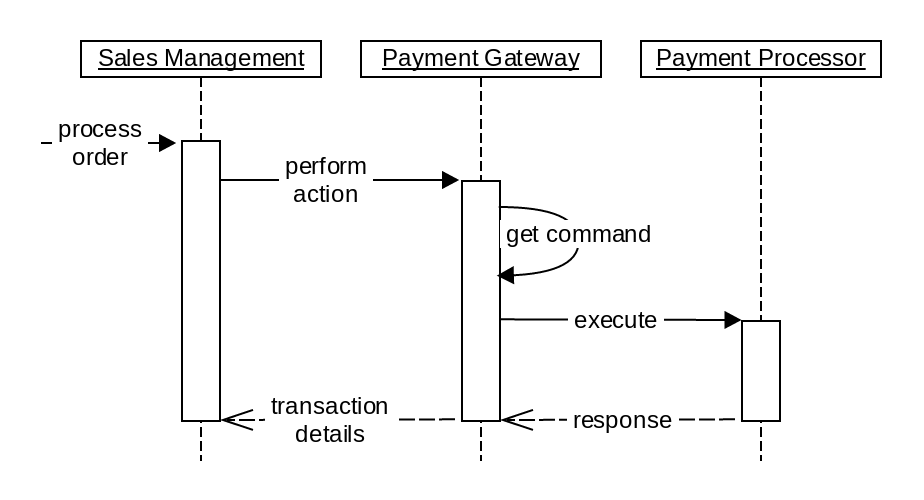

<Fragment src='/_includes/braintree-note.md'/>

# Commerce payment provider gateway

### What is Adobe Commerce payment provider gateway

The Adobe Commerce payment provider gateway is a mechanism that allows you to integrate your stores with payment service providers. As a result, you can create and handle transactions based on order details.

The following diagram shows a simplified interaction flow between Adobe Commerce sales management and external payment service provider using Commerce payment provider gateway:

Commerce payment provider supports the following payment operations:

-  authorize: process authorization transaction; funds are blocked on customer account, but not withdrawn

-  sale: process authorization transaction and capture automatically, funds are withdrawn

-  capture: withdraw previously authorized amount

-  refund: return previously withdrawn customer funds

-  void: cancel transfer of funds from customer account

### What's in this chapter

The topics of this chapter are conceptual and describe the components of the Commerce payment provider gateway:

-  [Payment provider gateway structure](payment-gateway-structure.md)

-  [Gateway Command](gateway-command.md)

-  [Gateway Command Pool](command-pool.md)

-  [Request Builder](request-builder.md)

-  [Gateway Client](gateway-client.md)

-  [Response Validator](response-validator.md)

-  [Response Handler](response-handler.md)

#### Terms used

| Term        | Description                                                                                                                                                                                                                                                                |
| ----------- |----------------------------------------------------------------------------------------------------------------------------------------------------------------------------------------------------------------------------------------------------------------------------|
| Commerce sales management | Commerce interfaces that provide the ability to create orders, invoices, and shipments.                                                                                                                                                                                    |
| Payment service provider, payment provider, payment processor | Online service for accepting electronic payments, like PayPal, Authorize.Net and so on.                                                                                                                                                                                    |
| Payload | Data used for a transaction. Might include the following: \<ul\>\<li\>Payment details\</li\>\<li\>Order items\</li\>\<li\>Shipping, billing addresses\</li\>\<li\>Customer details\</li\>\<li\>Taxes\</li\>\<li\>Merchant's payment provider API credentials\</li\>\</ul\> |
