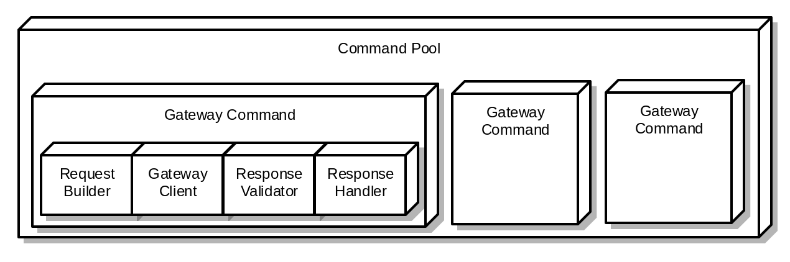
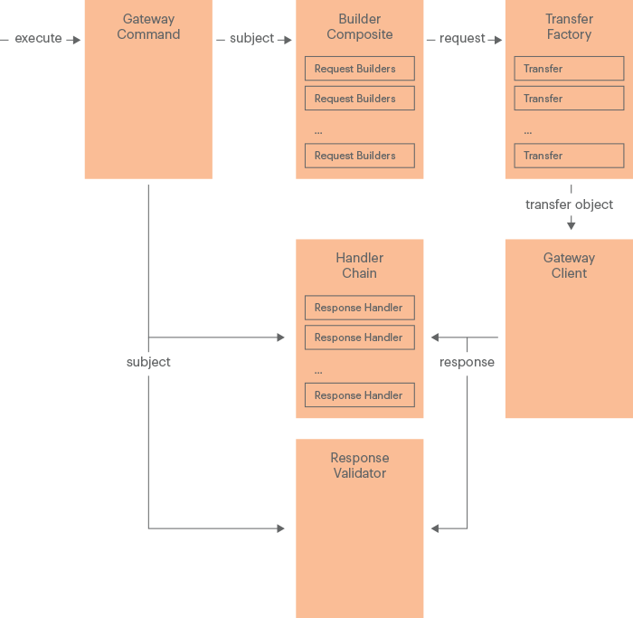

import Docs from '/src/pages/_includes/braintree-note.md'

<Docs />

# Payment provider gateway structure

The following diagram shows the basic components of the Adobe Commerce payment provider gateway:

The interaction between the [payment gateway](https://glossary.magento.com/payment-gateway) components looks like following:

Each component from this scheme is described in the corresponding topic:

-  [Gateway Command](gateway-command.md)

-  [Gateway Command Pool](command-pool.md)

-  [Request Builder](request-builder.md)

-  [Gateway Client](gateway-client.md)

-  [Response Validator](response-validator.md)

-  [Response Handler](response-handler.md)
