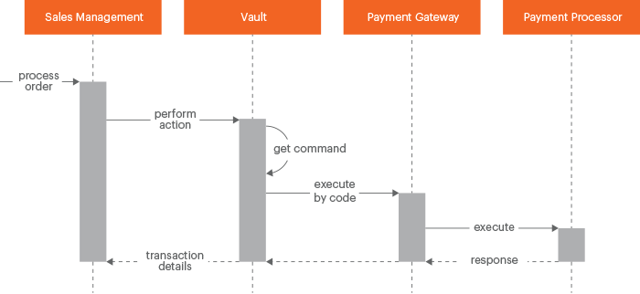

<Fragment src='/_includes/braintree-note.md'/>

# Adding vault integration

Vault as a payment method provides store customers with ability to use the previously saved credit card information for checkout. This information is stored safely on the side of trusted payments gateways (Braintree, PayPal). Not storing the sensitive credit card information is one of the [PCI compliance](https://www.pcisecuritystandards.org/) requirements.

The [Commerce Vault](https://github.com/magento/magento2/tree/2.4/app/code/Magento/Vault) is implemented using the Adobe Commerce [payment gateway](../payment-gateway/index.md). It is used in the out-of-the-box vault implementation for the Braintree payment method. Third party developers can use it to add vault to their custom payment provider integration.

The following diagram shows a simplified interaction flow between Commerce sales management, vault, payment integration and external payment service provider.

The flow is similar to usual Commerce [payment gateway interaction flow](../payment-gateway/index.md).

The main difference is that when vault is used, it defines what command is required and when it must be called.

## Adding vault: general steps

Commerce vault implementation provides that vault is available as a separate payment method during order creation (storefront or admin). But technically it is tightly related to the corresponding payment provider integration.
You do not need to create a new module for vault implementation. All required configuration and entities are added to the module of the payment provider integration.

The topics of this chapter describe how to add the vault functionality to a payment method (the payment method must be implemented using Commerce payment gateway):

1. [Add vault to module dependencies](module-configuration.md).

1. [Configure vault general parameters](vault-payment-configuration.md).

1. [Add vault and payment methods entities using dependency injection configuration](vault-di.md).

1. [Implement the ability for customers to choose whether to use vault](enabler.md).

1. [Storing and processing the payment related data](payment-token.md).

1. [Adding and using UI_Vault component to place orders on the storefront](token-ui-component-provider.md).

1. [Display stored tokens for customer and process their deleting](customer-stored-payments.md).

1. [Using stored tokens to place an order from Admin panel](admin-integration.md).
