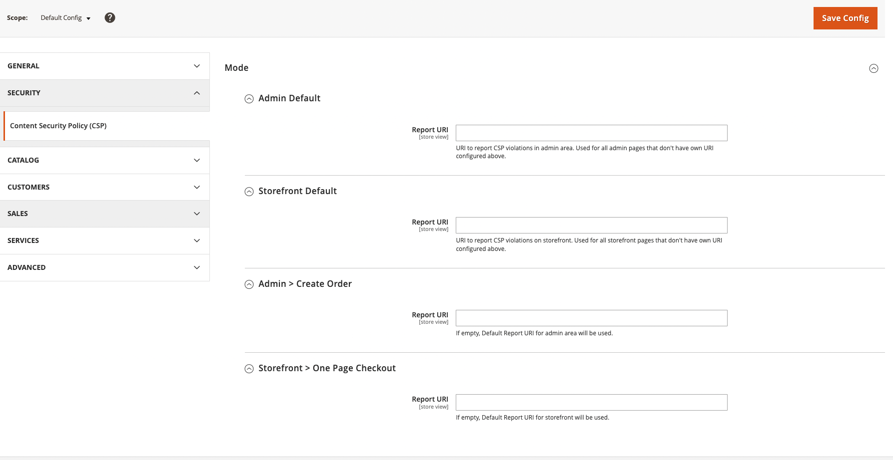

# Content security policies

Content Security Policies (CSP) are a powerful tool to mitigate against Cross Site Scripting (XSS)
and related attacks, including card skimmers, session hijacking, clickjacking, and more. Web servers
send CSPs in response HTTP headers (namely `Content-Security-Policy` and
`Content-Security-Policy-Report-Only`) to browsers that whitelist the origins of scripts, styles,
and other resources. Together, CSPs and built-in browser features help prevent:

*  Loading a malicious script from an attacker's website
*  A malicious inline script from sending credit card info to an attacker's website
*  Loading a malicious style that will make users click on an element that wasn't supposed to be on a page

See [Content Security Policy (CSP)](https://developer.mozilla.org/en-US/docs/Web/HTTP/CSP)
and [Content-Security-Policy](https://developer.mozilla.org/en-US/docs/Web/HTTP/Headers/Content-Security-Policy)
to learn more about CSP and each individual policy.

## Application support

As of version 2.3.5, Adobe Commerce and Magento Open Source support CSP headers and provides ways to configure them. (This
functionality is defined in the Magento_Csp module.) The application also provides default configurations at
the application level and for individual core modules that require extra configuration. Policies can
be configured for `adminhtml` and `storefront` areas separately to accommodate different use cases.
The application also permits configuring unique CSPs for specific pages.

CSP can work in two modes:

*  `report-only` - In this mode, the application reports policy violations but does not interfere. This mode is useful for debugging.  By default, CSP violations are written to the browser console, but they can be configured to be reported to an endpoint as an HTTP request to collect logs. There are a number of services that will collect, store, and sort your store's CSP violations reports for you.

*  `restrict mode` - In this mode, the application acts on any policy violations.

## Default configuration
Beginning version 2.4.7, CSP will be configured in `restrict-mode` by default for payment pages in the storefront and admin areas and in `report-only` mode for all other pages.
The corresponding CSP header will not contain the `unsafe-inline` keyword inside the `script-src` directive for payment pages.
Also, only whitelisted inline scripts will be allowed.

Prior to version 2.4.7, CSP was configured in `report-only` mode for all pages.

Once configured, the application can enforce policies like these:

*  Any resource, such as `.js`, `.css`, `.jpg`, or `.ttf` files, can only be loaded from the store's domain
*  Iframes can only include pages from the store itself
*  AJAX requests can only be sent to the store
*  Forms can only be sent to the store
*  Only whitelisted inline scripts and styles can be compiled by browser

For more details, check the `Magento/Csp/etc/config.xml` file. Some domains have already been
whitelisted for modules that require it. For instance if the `Magento_Paypal` module is installed,
`www.paypal.com` is already whitelisted for the `script-src` policy. If inline scripts and styles have also been whitelisted,
their hashes will be added to the `Content-Security-Policy` header only when inline scripts/styles are not allowed.

Please note that `eval()` is still allowed.

## Configure a module's CSP mode

You can set the CSP mode in a custom module by editing the module's `etc/config.xml` file. To
set the mode to `restrict`, change the value of the `default/csp/mode/admin/report_only`
and/or the `default/csp/mode/storefront/report_only` element to 0. To enable `report-only` mode,
set the values to 1.

Example `config.xml`:

```xml
<?xml version="1.0"?>
<config xmlns:xsi="http://www.w3.org/2001/XMLSchema-instance" xsi:noNamespaceSchemaLocation="urn:magento:module:Magento_Store:etc/config.xsd">
    <default>
        <csp>
            <mode>
                <storefront>
                    <report_only>0</report_only>
                </storefront>
                <admin>
                    <report_only>0</report_only>
                </admin>
            </mode>
        </csp>
    </default>
</config>
```

You can use the `etc/config.xml` file in the `Magento_Csp` module as a reference.
[Create your component file structure](../build/component-file-structure.md)
describes how to create a module.

## Configure CSPs for your custom code/extension/theme

Adobe Commerce and Magento Open Source provide multiple ways to add whitelisted resources to your custom code, extension, or theme.
Be sure to add resources only in modules that require it. For example, adding a domain to a `default-src`
policy when you only need to load a `.js` file from it is not recommended. Add the domain to `script-src`
instead.

The following table describes each type of CSP:

Policy name | Description
--- | ---
`default-src` | The default policy.
`base-uri` | Defines which URLs can appear in a page's `<base>` element.
`child-src` | Defines the sources for workers and embedded frame contents.
`connect-src` | Defines the sources that can be loaded using script interfaces.
`font-src` | Defines which sources can serve fonts.
`form-action` | Defines valid endpoints for submission from `<form>` tags.
`frame-ancestors` | Defines the sources that can embed the current page.
`frame-src` | Defines the sources for elements such as `<frame>` and `<iframe>`.
`img-src` | Defines the sources from which images can be loaded.
`manifest-src` | Defines the allowable contents of web app manifests.
`media-src` | Defines the sources from which images can be loaded.
`object-src` | Defines the sources for the `<object>`, `<embed>`, and `<applet>` elements.
`script-src` | Defines the sources for JavaScript `<script>` elements.
`style-src` | Defines the sources for stylesheets.

### Add a domain to the whitelist

You can add a domain to the whitelist for a policy (like `script-src`, `style-src`, `font-src` and others) by
adding a `csp_whitelist.xml` to your custom module's `etc` folder.

```xml
<?xml version="1.0"?>
<csp_whitelist xmlns:xsi="http://www.w3.org/2001/XMLSchema-instance" xsi:noNamespaceSchemaLocation="urn:magento:module:Magento_Csp:etc/csp_whitelist.xsd">
    <policies>
        <policy id="script-src">
            <values>
                <value id="devdocs-base" type="host">https://developer.adobe.com</value>
                <value id="magento" type="host">https://magento.com</value>
            </values>
        </policy>
        <policy id="connect-src">
            <values>
                <value id="devdocs" type="host">https://developer.adobe.com</value>
            </values>
        </policy>
    </policies>
</csp_whitelist>
```

### Using CSP nonce provider to allow inline script

Beginning version 2.4.7, Magento Open Source and Adobe Commerce supports Content Security Policy (CSP) nonce. 
This enhancement introduces a CSP nonce provider, which facilitates the generation of unique nonce strings for each request. 
These nonce strings are then attached to the CSP header.
You can utilize  `Magento\Csp\Helper\CspNonceProvider::generateNonce()` in your class to obtain a nonce string like:

```php
use Magento\Csp\Helper\CspNonceProvider;

class MyClass
{

    /**
     * @param CspNonceProvider $cspNonceProvider
     */
    public function __construct(CspNonceProvider $cspNonceProvider)
    {
        $this->cspNonceProvider = $cspNonceProvider
    }

    /**
     * @var CspNonceProvider
     */
    private $cspNonceProvider;

    /**
     * Get CSP Nonce
     *
     * @return String
     */
    public function getNonce(): string
    {
        return $this->cspNonceProvider->generateNonce();
    }
}
```

### Whitelist an inline script or style

Stores that have `unsafe-inline` disabled for `style-src` and `script-src` (default for Adobe Commerce and Magento Open Source 2.4) inline scripts and styles
must be whitelisted.

You must use `Magento\Framework\View\Helper\SecureHtmlRenderer`, which is available
as a `$secureRenderer` variable in the _.phtml_ templates to achieve this.

*  For `script` or `style` tags containing inline JavaScript/CSS, use `renderTag`:

#### Inside a .phtml template

```html
<div>Other content</div>
<?= $secureRenderer->renderTag('script', ['type' => 'text/javascript'], "\nconsole.log('I am a whitelisted script');\n", false); ?>
```

#### Inside a class responsible for HTML rendering_

```php
/** @var \Magento\Framework\View\Helper\SecureHtmlRenderer */
private $secureRenderer;

...

function someMethod() {
   ....

   $html .= $this->secureRenderer->renderTag('style', [], "#element { color: blue } ", false);

   ....
}
```

*  For event handlers previously defined in HTML attributes, use `renderEventListenerAsTag`:

#### Inside a .phtml template

```html
<!-- <div onclick="alert('Old way!')">Old way</div> -->

<div id="alert-div">New way</div>
<?= $secureRenderer->renderEventListenerAsTag('onclick', 'alert("New way!");', '#alert-div'); ?>
```

*  For inline styles previously defined in `style` attributes, use `renderStyleAsTag`:

#### Inside a .phtml template

```html
<!-- <div style="color:blue">Old way</div> -->

<div id="blue-div">New way</div>
<?= $secureRenderer->renderStyleAsTag('color: blue', '#blue-div'); ?>
```

#### Using inline scripts and styles is discouraged in favor of UI Components and classes

You can also whitelist inline CSS and JS inside `style` and `script` tags in a `csp_whitelist.xml` file.
To do this, get a `sha256` hash of a tag's content and encode it as BASE64, then
add it to your module's `csp_whitelist.xml`. Programmatically, it could look like this:

```php
$whitelistHash = base64_encode(hash('sha256', $content, true));
```

Add the corresponding policy to a `csp_whitelist.xml` file:

```xml
<?xml version="1.0"?>
<csp_whitelist xmlns:xsi="http://www.w3.org/2001/XMLSchema-instance" xsi:noNamespaceSchemaLocation="urn:magento:module:Magento_Csp:etc/csp_whitelist.xsd">
    <policies>
        <policy id="script-src">
            <values>
                <value id="my-scripts-hash" type="hash" algorithm="sha256">B4yPHKaXnvFWtRChIbabYmUBFZdVfKKXHbWtWidDVF8=</value>
            </values>
        </policy>
    </policies>
</csp_whitelist>
```

<InlineAlert variant="info" slots="text"/>

When _unsafe-inline_ is allowed for `script-src` or `style-src` policies, whitelisted inline scripts/styles hashes
will not appear in the `Content-Security-Policy` header.

### Advanced CSP configuration

To configure other CSPs such as `sandbox` policy, which does not consist of whitelisted hosts
and hashes, or for more advanced `fetch` policy configurations, like removing inline support from `script-src`,
you would have to create a `config.xml` file inside your custom module and rewrite the default values.
For reference, see `Magento\Csp\etc\config.xml`.

### Report-Uri configuration

Regardless of `restrict` or `report-only` mode, CSP violations may be reported to an endpoint for collection.

1. On the _Admin_ sidebar, go to **Stores** > _Settings_ > **Configuration**.

   If you have a multi-site installation, set the Store View control in the upper-left corner to the website where the configuration applies.

2. In the left panel under _Security_, choose **Content Security Policy**



The create order page in the admin and the checkout page in the storefront can be configured to have their own URI. However, if these fields are left blank then the default URI for the admin and storefront areas will be used for reporting.

The URL to use for reporting by browsers can also be configured programmatically in your custom module's `config.xml` file:

```xml
<?xml version="1.0"?>
<config xmlns:xsi="http://www.w3.org/2001/XMLSchema-instance" xsi:noNamespaceSchemaLocation="urn:magento:module:Magento_Store:etc/config.xsd">
    <default>
        <csp>
            <mode>
                <storefront>
                    <report_uri>http://csp-reporting-service.com/my-project/endpoint</report_uri>
                </storefront>
                <admin>
                    <report_uri>http://csp-reporting-service.com/my-project/endpoint</report_uri>
                </admin>
            </mode>
        </csp>
    </default>
</config>
```

### Page specific Content-Security-Policies

Adobe Commerce and Magento Open Source can send unique policies for a specific page.
For example, to configure policies for the checkout page in the storefront, add the following in your custom module's `config.xml`

```xml
<?xml version="1.0"?>
<config xmlns:xsi="http://www.w3.org/2001/XMLSchema-instance" xsi:noNamespaceSchemaLocation="urn:magento:module:Magento_Store:etc/config.xsd">
    <default>
       <csp>
          <mode>
             <storefront_checkout_index_index>
                <report_only>0</report_only>
             </storefront_checkout_index_index>
          </mode>
          <policies>
             <storefront_checkout_index_index>
                <scripts>
                   <inline>0</inline>
                   <event_handlers>1</event_handlers>
                </scripts>
             </storefront_checkout_index_index>
          </policies>
       </csp>
    </default>
</config>
```

Alternatively, you can implement `Magento\Csp\Api\CspAwareActionInterface`
in a controller responsible for the page and define the `modifyCsp` method. It receives existing CSPs
read from configs and allows you redefine them by returning a new list. See the example below:

```php
class Mypage extends \Magento\Framework\App\Action\Action implements \Magento\Csp\Api\CspAwareActionInterface
{
    /**
     * My custom page.
     *
     * @inheritDoc
     */
    public function execute()
    {
        return $this->resultPageFactory->create();
    }

    public function modifyCsp(array $appliedPolicies): array
    {
        $appliedPolicies[] = new \Magento\Csp\Model\Policy\FetchPolicy(
            'form-action',
            false,
            ['https://my-site.com'],
            ['https']
        );

        return $appliedPolicies;
    }
}
```

You do not need to define other policy options in contexts like _unsafe-inline_. The same
policy options read from config will be merged later.

### Troubleshooting

Users might sometimes see browser errors due to certain scripts being blocked because of CSP

`Refused to execute inline script because it violates the following Content Security Policy directive: "script-src`

To fix this issue, you must [whitelist](https://developer.adobe.com/commerce/php/development/security/content-security-policies/#whitelist-an-inline-script-or-style) the blocked scripts using the `SecureHtmlRenderer` class or use the [CSPNonceProvider](https://developer.adobe.com/development/security/content-security-policies/#using-csp-nonce-provider-to-allow-inline-script) class to allow scripts to be executed.
