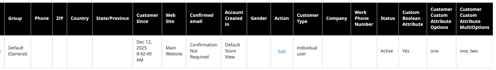

# Add a custom boolean attribute

This tutorial describes how a developer can create a custom boolean (Yes/No) attribute for the Customer entity using code. This will reflect in both the [Customer Grid](https://experienceleague.adobe.com/en/docs/commerce-admin/customers/customer-accounts/manage/manage-account) and the [Customer Form](https://experienceleague.adobe.com/en/docs/commerce-admin/customers/customer-accounts/manage/update-account) in the Admin.

This Customer attribute will be used to store a simple Yes/No flag on a customer record, as an example. It will be created as an EAV attribute in a data patch. The EAV model allows a developer to add custom functionality to the entities without modifying the core databases and schemas. Data patches are run just once, so this code will create the custom attribute and will never run again, which could cause issues. This tutorial also implements `PatchRevertableInterface`, which allows the attribute to be cleanly removed by running `bin/magento setup:rollback`.

## Code

### Create the data patch class

Create a data patch class called `AddCustomerAttributeBoolean` under the `\ExampleCorp\Customer\Setup\Patch\Data` namespace. This makes the application execute the data patch automatically when `bin/magento setup:upgrade` is run. This class implements both `\Magento\Framework\Setup\Patch\DataPatchInterface` and `\Magento\Framework\Setup\Patch\PatchRevertableInterface`. Adding the revertable interface requires implementing a `revert()` method that removes the attribute when the patch is rolled back.

```php
namespace ExampleCorp\Customer\Setup\Patch\Data;

use \Magento\Framework\Setup\Patch\DataPatchInterface;
use \Magento\Framework\Setup\Patch\PatchRevertableInterface;

class AddCustomerAttributeBoolean implements DataPatchInterface, PatchRevertableInterface
{
    public function apply(): void
    {
        // will be implemented in the next steps.
    }

    public function revert(): void
    {
        // will be implemented in the next steps.
    }

    public function getAliases(): array
    {
        // will be implemented in the next steps.
    }

    public static function getDependencies(): array
    {
        // will be implemented in the next steps.
    }
}
```

### Inject the dependencies

The dependencies to the data patch are injected using constructor DI and are listed below:

-  `\Magento\Framework\Setup\ModuleDataSetupInterface` for initializing and ending the setup.
-  `\Magento\Customer\Setup\CustomerSetupFactory` for creating a model of `\Magento\Customer\Setup\CustomerSetup` which is required to add and remove the custom attribute.
-  `\Magento\Customer\Model\ResourceModel\Attribute` aliased as `AttributeResource` for saving the attribute after adding custom data to it.
-  `\Psr\Log\LoggerInterface` for logging exceptions thrown during the execution.

The factory is stored rather than a single `CustomerSetup` instance, because both `apply()` and `revert()` need to create their own instance.

```php

/**
 * Constructor
 *
 * @param ModuleDataSetupInterface $moduleDataSetup
 * @param CustomerSetupFactory $customerSetupFactory
 * @param AttributeResource $attributeResource
 * @param LoggerInterface $logger
 */
public function __construct(
    ModuleDataSetupInterface $moduleDataSetup,
    CustomerSetupFactory $customerSetupFactory,
    AttributeResource $attributeResource,
    LoggerInterface $logger
) {
    $this->moduleDataSetup = $moduleDataSetup;
    $this->customerSetupFactory = $customerSetupFactory;
    $this->attributeResource = $attributeResource;
    $this->logger = $logger;
}
```

### Implement the apply method

There are five steps in developing a data patch. All the steps below are written inside the `apply` method.

1. Starting and ending the setup execution. This turns off foreign key checks and sets the SQL mode.

    ```php
    $this->moduleDataSetup->getConnection()->startSetup();

    /*
      Attribute creation code must be run between these two lines
      to ensure that the attribute is created smoothly.
     */

    $this->moduleDataSetup->getConnection()->endSetup();
    ```

1. Add the boolean customer attribute with the required settings.

    Boolean attributes are stored as integers (`0` for No, `1` for Yes). Set `type` to `int`, `input` to `boolean`, and assign the built-in `Boolean` source model, which provides the Yes/No option list.

    The third parameter for `addAttribute` is an array of settings required to configure the attribute. Passing an empty array uses all the default values for each possible setting. To keep the code to a minimum, just declare the settings needing to be overridden and the rest of the settings will be used from the defaults.

    The `\Magento\Customer\Api\CustomerMetadataInterface` interface contains constants like the customer entity's code and the default attribute set code, which can be referenced.

    ```php
    /** @var CustomerSetup $customerSetup */
    $customerSetup = $this->customerSetupFactory->create(['setup' => $this->moduleDataSetup]);

    $customerSetup->addAttribute(
        CustomerMetadataInterface::ENTITY_TYPE_CUSTOMER, // entity type code
        'custom_boolean_attribute', // unique attribute code
        [
            'label' => 'Custom Boolean Attribute',
            'type' => 'int',
            'input' => 'boolean',
            'source' => \Magento\Eav\Model\Entity\Attribute\Source\Boolean::class,
            'required' => false,
            'position' => 333,
            'system' => false,
            'user_defined' => true,
            'is_used_in_grid' => true,
            'is_visible_in_grid' => true,
            'is_filterable_in_grid' => true,
            'is_searchable_in_grid' => false,
        ]
    );
    ```

    | Setting Key | Description |
    | --- | --- |
    | `label` | `Custom Boolean Attribute` - Label for displaying the attribute value |
    | `type` | `int` - Stored as an integer in the database (`0` or `1`) |
    | `input` | `boolean` - Renders as a Yes/No select in the customer form |
    | `source` | Provides the Yes/No option list for the boolean input |
    | `required` | `false` - Attribute will be an optional field in the customer form |
    | `position` | `333` - Sort order in the customer form |
    | `system` | `false` - Not a system-defined attribute |
    | `user_defined` | `true` - A user-defined attribute |
    | `is_used_in_grid` | `true` - Ready for use in the customer grid |
    | `is_visible_in_grid` | `true` - Visible in the customer grid |
    | `is_filterable_in_grid` | `true` - Filterable in the customer grid |
    | `is_searchable_in_grid` | `false` - Not searchable in the customer grid (boolean fields are filtered, not searched) |

1. Add attribute to an attribute set and group.

    There is only one attribute set and group for the customer entity. The default attribute set ID is a constant defined in the `CustomerMetadataInterface` interface and setting the attribute group ID to null makes the application use the default attribute group ID for the customer entity.

    ```php
    $customerSetup->addAttributeToSet(
        CustomerMetadataInterface::ENTITY_TYPE_CUSTOMER, // entity type code
        CustomerMetadataInterface::ATTRIBUTE_SET_ID_CUSTOMER, // attribute set ID
        null, // attribute group ID
        'custom_boolean_attribute' // unique attribute code
    );
    ```

1. Make the attribute visible in the customer form.

    ```php
    // Get the newly created attribute's model
    $attribute = $customerSetup->getEavConfig()
        ->getAttribute(CustomerMetadataInterface::ENTITY_TYPE_CUSTOMER, 'custom_boolean_attribute');

    // Make attribute visible in Admin customer form and storefront forms
    $attribute->setData('used_in_forms', [
        'adminhtml_customer',
        'customer_account_create',
        'customer_account_edit',
    ]);

    // Save modified attribute model using its resource model
    $this->attributeResource->save($attribute);
    ```

    Unlike the text field attribute, which is visible only in the Admin, the boolean attribute is also registered for the storefront registration and account edit forms. Adjust the `used_in_forms` values to match the visibility requirements of your project.

1. Gracefully handle exceptions.

    ```php
    try {
        // All the code inside the apply method goes into the try block.
    } catch (Exception $exception) {
        $this->logger->error($exception->getMessage());
    }
    ```

### Implement the revert method

Because this class implements `PatchRevertableInterface`, it must also define a `revert()` method. This method is called when `bin/magento setup:rollback` targets this patch and removes the attribute from the system.

```php
public function revert(): void
{
    $this->moduleDataSetup->getConnection()->startSetup();

    /** @var CustomerSetup $customerSetup */
    $customerSetup = $this->customerSetupFactory->create(['setup' => $this->moduleDataSetup]);

    try {
        $customerSetup->removeAttribute(
            CustomerMetadataInterface::ENTITY_TYPE_CUSTOMER,
            'custom_boolean_attribute'
        );
    } catch (Exception $e) {
        $this->logger->error($e->getMessage());
    }

    $this->moduleDataSetup->getConnection()->endSetup();
}
```

### Implement rest of the interface

This data patch does not have any other patch as a dependency, and this data patch was not renamed earlier, so both `getDependencies` and `getAliases` can return an empty array.

```php
public static function getDependencies(): array
{
    return [];
}

public function getAliases(): array
{
    return [];
}
```

### Execute the data patch

Run `bin/magento setup:upgrade` from the project root to execute the newly added data patch.

-  The attribute is created in the customer form under the _Account Information_ section.

   

-  The attribute is displayed in the customer grid and can be filtered using a Yes/No dropdown.

   

To remove the attribute, run `bin/magento setup:rollback` and target this patch. The `revert()` method will execute and delete the attribute from the system.

### Code reference

```php
<?php
declare(strict_types=1);

namespace ExampleCorp\Customer\Setup\Patch\Data;

use Exception;
use Psr\Log\LoggerInterface;
use Magento\Customer\Api\CustomerMetadataInterface;
use Magento\Customer\Model\ResourceModel\Attribute as AttributeResource;
use Magento\Customer\Setup\CustomerSetup;
use Magento\Customer\Setup\CustomerSetupFactory;
use Magento\Eav\Model\Entity\Attribute\Source\Boolean;
use Magento\Framework\Setup\ModuleDataSetupInterface;
use Magento\Framework\Setup\Patch\DataPatchInterface;
use Magento\Framework\Setup\Patch\PatchRevertableInterface;

/**
 * Creates a customer attribute for managing a customer's boolean flag
 */
class AddCustomerAttributeBoolean implements DataPatchInterface, PatchRevertableInterface
{
    /**
     * @var ModuleDataSetupInterface
     */
    private $moduleDataSetup;

    /**
     * @var CustomerSetupFactory
     */
    private $customerSetupFactory;

    /**
     * @var AttributeResource
     */
    private $attributeResource;

    /**
     * @var LoggerInterface
     */
    private $logger;

    /**
     * Constructor
     *
     * @param ModuleDataSetupInterface $moduleDataSetup
     * @param CustomerSetupFactory $customerSetupFactory
     * @param AttributeResource $attributeResource
     * @param LoggerInterface $logger
     */
    public function __construct(
        ModuleDataSetupInterface $moduleDataSetup,
        CustomerSetupFactory $customerSetupFactory,
        AttributeResource $attributeResource,
        LoggerInterface $logger
    ) {
        $this->moduleDataSetup = $moduleDataSetup;
        $this->customerSetupFactory = $customerSetupFactory;
        $this->attributeResource = $attributeResource;
        $this->logger = $logger;
    }

    /**
     * Get array of patches that have to be executed prior to this.
     *
     * @return string[]
     */
    public static function getDependencies(): array
    {
        return [];
    }

    /**
     * Get aliases (previous names) for the patch.
     *
     * @return string[]
     */
    public function getAliases(): array
    {
        return [];
    }

    /**
     * Run code inside patch
     */
    public function apply(): void
    {
        // Start setup
        $this->moduleDataSetup->getConnection()->startSetup();

        /** @var CustomerSetup $customerSetup */
        $customerSetup = $this->customerSetupFactory->create(['setup' => $this->moduleDataSetup]);

        try {
            // Add customer attribute with settings
            $customerSetup->addAttribute(
                CustomerMetadataInterface::ENTITY_TYPE_CUSTOMER,
                'custom_boolean_attribute',
                [
                    'label' => 'Custom Boolean Attribute',
                    'type' => 'int',
                    'input' => 'boolean',
                    'source' => Boolean::class,
                    'required' => false,
                    'position' => 333,
                    'system' => false,
                    'user_defined' => true,
                    'is_used_in_grid' => true,
                    'is_visible_in_grid' => true,
                    'is_filterable_in_grid' => true,
                    'is_searchable_in_grid' => false,
                ]
            );

            // Add attribute to default attribute set and group
            $customerSetup->addAttributeToSet(
                CustomerMetadataInterface::ENTITY_TYPE_CUSTOMER,
                CustomerMetadataInterface::ATTRIBUTE_SET_ID_CUSTOMER,
                null,
                'custom_boolean_attribute'
            );

            // Get the newly created attribute's model
            $attribute = $customerSetup->getEavConfig()
                ->getAttribute(CustomerMetadataInterface::ENTITY_TYPE_CUSTOMER, 'custom_boolean_attribute');

            // Make attribute visible in Admin customer form and storefront forms
            $attribute->setData('used_in_forms', [
                'adminhtml_customer',
                'customer_account_create',
                'customer_account_edit',
            ]);

            // Save attribute using its resource model
            $this->attributeResource->save($attribute);
        } catch (Exception $e) {
            $this->logger->error($e->getMessage());
        }

        // End setup
        $this->moduleDataSetup->getConnection()->endSetup();
    }

    /**
     * Rollback all changes, done by this patch
     */
    public function revert(): void
    {
        // Start setup
        $this->moduleDataSetup->getConnection()->startSetup();

        /** @var CustomerSetup $customerSetup */
        $customerSetup = $this->customerSetupFactory->create(['setup' => $this->moduleDataSetup]);

        try {
            $customerSetup->removeAttribute(
                CustomerMetadataInterface::ENTITY_TYPE_CUSTOMER,
                'custom_boolean_attribute'
            );
        } catch (Exception $e) {
            $this->logger->error($e->getMessage());
        }

        // End setup
        $this->moduleDataSetup->getConnection()->endSetup();
    }
}
```

