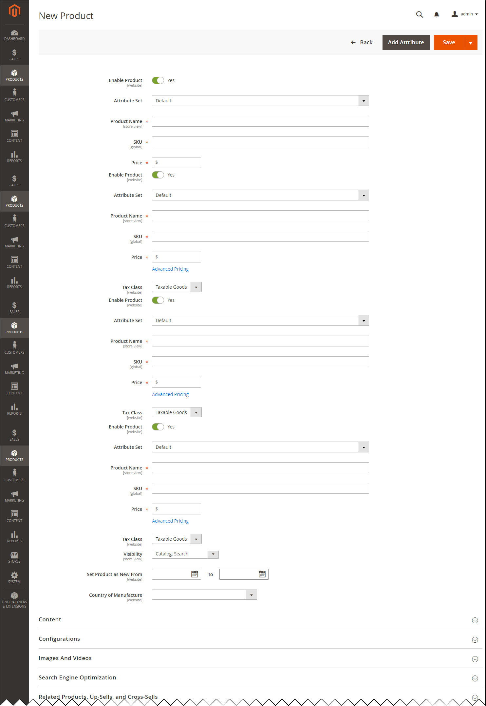

# Customize the product creation form

This tutorial describes how developers can customize the product creation form used on the product creation and product edit pages in Admin. The product creation form is implemented using the [form UI component](https://developer.adobe.com/commerce/frontend-core/ui-components/components/form/).

Product attributes and attribute sets available in the form, can be customized and added under **STORES** > **Attributes** in the Admin. But you can also customize the form view and behavior in code. The following sections describe what files define the form and how they can be customized in your module.

## Prerequisites

[Change to developer mode](https://experienceleague.adobe.com/en/docs/commerce-operations/configuration-guide/cli/set-mode) while you perform all customizations and debugging.

For the sake of compatibility, upgradability, and easy maintenance, do not edit the default application code. Instead, add your customizations in a separate module.

## List of customization methods

This tutorial includes the following customizations:

*  [Customize the form configuration](configuration.md)
*  [Customize using a modifier class](modifier-class.md)

The following image is an illustration of the default view of the form on the **New Product** page:

