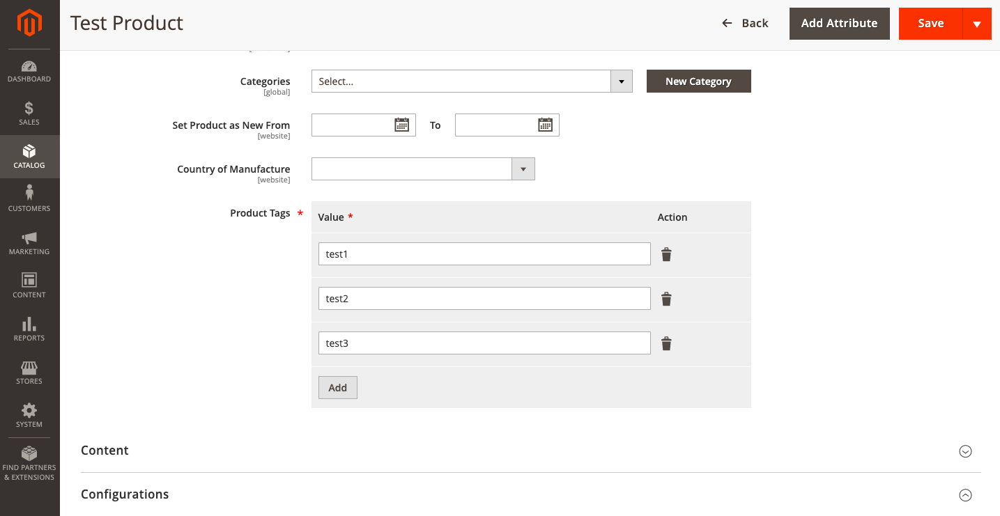
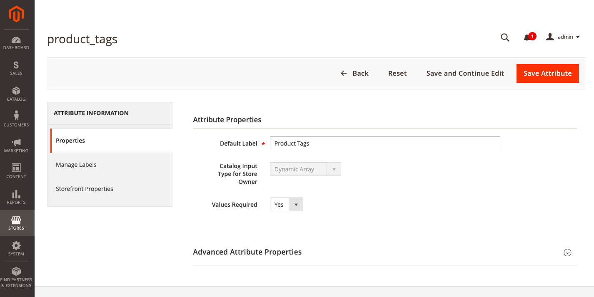

# Create a custom product attribute input type

This tutorial shows you how to add a custom product attribute input type. 

We will create an extension that adds a `Dynamic Array` attribute input type and a product attribute `Product Tags` of that type.

The final result will look like this:





The final extension is available on [Github](https://github.com/goivvy/new-attribute-type).

## Add a new product attribute input type

To define a new input type, we need to modify arguments of `Magento\Eav\Model\Adminhtml\System\Config\Source\Inputtype` and setup a new UI modifier.

***`app/code/Goivvy/Attribute/etc/adminhtml/di.xml`***:

```xml
<?xml version="1.0"?>
<config xmlns:xsi="http://www.w3.org/2001/XMLSchema-instance" xsi:noNamespaceSchemaLocation="urn:magento:framework:ObjectManager/etc/config.xsd">
    <type name="Magento\Eav\Model\Adminhtml\System\Config\Source\Inputtype">
        <arguments>
            <argument name="optionsArray" xsi:type="array">
                <item name="350" xsi:type="array">
                    <item name="value" xsi:type="string">dynamicarray</item>
                    <item name="label" xsi:type="string" translatable="true">Dynamic Array</item>
                </item>
            </argument>
        </arguments>
    </type>
    <virtualType name="Magento\Catalog\Ui\DataProvider\Product\Form\Modifier\Pool">
        <arguments>
            <argument name="modifiers" xsi:type="array">
                <item name="dynamicarray" xsi:type="array">
                    <item name="class" xsi:type="string">Goivvy\Attribute\Ui\DataProvider\Product\Form\Modifier\Dynamic</item>
                    <item name="sortOrder" xsi:type="number">50</item>
                </item>
            </argument>
        </arguments>
    </virtualType>
</config>
```

***`app/code/Goivvy/Attribute/Ui/DataProvider/Product/Form/Modifier/Dynamic.php`***:

```php
<?php
namespace Goivvy\Attribute\Ui\DataProvider\Product\Form\Modifier;

use Magento\Catalog\Ui\DataProvider\Product\Form\Modifier\AbstractModifier;
use Magento\Catalog\Model\ResourceModel\Eav\AttributeFactory as EavAttributeFactory;
use Magento\Catalog\Model\Locator\LocatorInterface;
use Magento\Catalog\Model\Product;
use Magento\Ui\Component\Container;
use Magento\Ui\Component\Form\Element\DataType\Text;
use Magento\Ui\Component\Form\Element\Input;
use Magento\Ui\Component\Form\Element\Select;
use Magento\Ui\Component\Form\Field;

class Dynamic extends AbstractModifier
{
    const FORM_ELEMENT_WEEE = 'dynamicarray';

    protected $eavAttributeFactory;
     
    protected $locator;

    public function __construct(
        LocatorInterface $locator,
        EavAttributeFactory $eavAttributeFactory
    ) {
        $this->locator = $locator;
        $this->eavAttributeFactory = $eavAttributeFactory;
    }
    
    public function modifyData(array $data)
    {
        return $data;
    }

    public function modifyMeta(array $meta)
    {
        foreach ($meta as $groupCode => $groupConfig) {
            $meta[$groupCode] = $this->modifyMetaConfig($groupConfig);
        }

        return $meta;
    }

    protected function modifyMetaConfig(array $metaConfig)
    {
        if (isset($metaConfig['children'])) {
            foreach ($metaConfig['children'] as $attributeCode => $attributeConfig) {
                if ($this->startsWith($attributeCode, self::CONTAINER_PREFIX)) {
                    $metaConfig['children'][$attributeCode] = $this->modifyMetaConfig($attributeConfig);
                } elseif (!empty($attributeConfig['arguments']['data']['config']['formElement']) &&
                    $attributeConfig['arguments']['data']['config']['formElement'] === static::FORM_ELEMENT_WEEE
                ) {
                    $metaConfig['children'][$attributeCode] =
                        $this->modifyAttributeConfig($attributeCode, $attributeConfig);
                }
            }
        }

        return $metaConfig;
    }

    protected function modifyAttributeConfig($attributeCode, array $attributeConfig)
    {
        $product = $this->locator->getProduct();
        $eavAttribute = $this->eavAttributeFactory->create()->loadByCode(Product::ENTITY, $attributeCode);

        return array_replace_recursive($attributeConfig, [
            'arguments' => [
                'data' => [
                    'config' => [
                        'componentType' => 'dynamicRows',
                        'formElement' => 'component',
                        'renderDefaultRecord' => false,
                        'itemTemplate' => 'record',
                        'dataScope' => '',
                        'dndConfig' => [
                            'enabled' => false,
                        ],
                        'required' => (bool)$attributeConfig['arguments']['data']['config']['required'],
                    ],
                ],
            ],
            'children' => [
                'record' => [
                    'arguments' => [
                        'data' => [
                            'config' => [
                                'componentType' => Container::NAME,
                                'isTemplate' => true,
                                'is_collection' => true,
                                'component' => 'Magento_Ui/js/dynamic-rows/record',
                                'dataScope' => '',
                            ],
                        ],
                    ],
                    'children' => [
                        'value' => [
                            'arguments' => [
                                'data' => [
                                    'config' => [
                                        'componentType' => Field::NAME,
                                        'formElement' => Input::NAME,
                                        'dataType' => Text::NAME,
                                        'label' => __('Value'),
                                        'enableLabel' => true,
                                        'dataScope' => 'value',
                                        'validation' => [
                                            'required-entry' => true
                                        ],
                                        'showLabel' => false,
                                    ],
                                ],
                            ],
                        ],
                        'actionDelete' => [
                            'arguments' => [
                                'data' => [
                                    'config' => [
                                        'componentType' => 'actionDelete',
                                        'dataType' => Text::NAME,
                                        'label' => __('Action'),
                                    ],
                                ],
                            ],
                        ],
                    ],
                ],
            ],
        ]);
    }   
}
```

Then we set a custom backend model for every attribute of type `dynamicarray`.

***`app/code/Goivvy/Attribute/etc/events.xml`***:

```xml
<?xml version="1.0"?>
<config xmlns:xsi="http://www.w3.org/2001/XMLSchema-instance" xsi:noNamespaceSchemaLocation="urn:magento:framework:Event/etc/events.xsd">
    <event name="catalog_entity_attribute_save_before">
        <observer name="dynamicarray" instance="Goivvy\Attribute\Observer\UpdateElement" />
    </event>
</config>
```

***`app/code/Goivvy/Attribute/Observer/UpdateElement.php`***:

```php
<?php
namespace Goivvy\Attribute\Observer;

use Magento\Framework\Event\ObserverInterface;

class UpdateElement implements ObserverInterface
{
    protected $productType;

    protected $productTypeConfig;

    public function __construct(
        \Magento\Catalog\Model\Product\Type $productType,
        \Magento\Catalog\Model\ProductTypes\ConfigInterface $productTypeConfig
    ) {
        $this->productType = $productType;
        $this->productTypeConfig = $productTypeConfig;
    }

    public function execute(\Magento\Framework\Event\Observer $observer)
    {
        $backendModel = \Goivvy\Attribute\Model\Attribute\Backend\Dynamic::class;
        $object = $observer->getEvent()->getAttribute();
        if ($object->getFrontendInput() == 'dynamicarray') {
            $object->setBackendModel($backendModel);
            if (!$object->getApplyTo()) {
                $applyTo = [];
                foreach ($this->productType->getOptions() as $option) {
                    if ($this->productTypeConfig->isProductSet($option['value'])) {
                        continue;
                    }
                    $applyTo[] = $option['value'];
                }
                $object->setApplyTo($applyTo);
            }
        }

        return $this;
    }
}
```

***`app/code/Goivvy/Attribute/Model/Attribute/Backend/Dynamic.php`***:

```php
<?php
namespace Goivvy\Attribute\Model\Attribute\Backend;

use Goivvy\Attribute\Model\ResourceModel\Attribute\Dynamic as ModelDynamic;

class Dynamic extends \Magento\Eav\Model\Entity\Attribute\Backend\AbstractBackend
{
   protected $_modelDynamic;

   public function __construct(ModelDynamic $modelDynamic)
   {
      $this->_modelDynamic = $modelDynamic; 
   }
    
   public function validate($object)
   {
      return $this; 
   }
     
   public function afterLoad($object)
   {
      $data = $this->_modelDynamic->loadProductData($object, $this->getAttribute());

      $object->setData($this->getAttribute()->getName(), $data);
      return $this;
   }

   public function afterSave($object)
   {
        $orig = $object->getOrigData($this->getAttribute()->getName());
        $current = $object->getData($this->getAttribute()->getName());
        if ($orig == $current) {
            return $this;
        }

        $this->_modelDynamic->deleteProductData($object, $this->getAttribute());
        $values = $object->getData($this->getAttribute()->getName());

        if (!is_array($values)) {
            return $this;
        }

        foreach ($values as $value) {
            if (empty($value['value'])  || !empty($value['delete'])) {
                continue;
            }

            $data = [];
            $data['value'] = $value['value'];
            $data['attribute_id'] = $this->getAttribute()->getId();

            $this->_modelDynamic->insertProductData($object, $data);
        }

        return $this;
   }

   public function afterDelete($object)
   {
        $this->_modelDynamic->deleteProductData($object, $this->getAttribute());
        return $this;
   }

   public function getTable()
   {
        return $this->_modelDynamic->getTable('goivvy_dynamic');
   }

   public function getEntityIdField()
   {
        return $this->_modelDynamic->getIdFieldName();
   }
}
```

Then we setup a DB table to hold all values of product attributes of type `dynamicarray`.

***`app/code/Goivvy/Attribute/etc/db_schema.xml`***:

```xml
<?xml version="1.0"?>
<schema xmlns:xsi="http://www.w3.org/2001/XMLSchema-instance"
        xsi:noNamespaceSchemaLocation="urn:magento:framework:Setup/Declaration/Schema/etc/schema.xsd">
    <table name="goivvy_dynamic" resource="default" engine="innodb" comment="Goivvy Custom Dynamic Attribute">
        <column xsi:type="int" name="id" unsigned="false" nullable="false" identity="true"
                comment="Value ID"/>
        <column xsi:type="int" name="product_id" unsigned="true" nullable="false" identity="false"
                default="0" comment="Product ID"/>
        <column xsi:type="smallint" name="attribute_id" unsigned="true" nullable="false" identity="false"
                comment="Attribute ID"/>
        <column xsi:type="varchar" name="value" nullable="false" length="255" comment="Value"/>
        <constraint xsi:type="primary" referenceId="PRIMARY">
            <column name="id"/>
        </constraint>
        <constraint xsi:type="foreign" referenceId="GOIVVY_DYNAMIC_PRODUCT_ID_CATALOG_PRODUCT_ENTITY_ENTITY_ID" table="goivvy_dynamic"
                    column="product_id" referenceTable="catalog_product_entity" referenceColumn="entity_id"
                    onDelete="CASCADE"/>
        <constraint xsi:type="foreign" referenceId="GOIVVY_DYNAMIC_ATTRIBUTE_ID_EAV_ATTRIBUTE_ATTRIBUTE_ID" table="goivvy_dynamic"
                    column="attribute_id" referenceTable="eav_attribute" referenceColumn="attribute_id"
                    onDelete="CASCADE"/>
        <index referenceId="GOIVVY_DYNAMIC_PRODUCT_ID" indexType="btree">
            <column name="product_id"/>
        </index>
        <index referenceId="GOIVVY_DYNAMIC_ATTRIBUTE_ID" indexType="btree">
            <column name="attribute_id"/>
        </index>
    </table>
</schema>
```

And add a resource model for attributes of type `dynamicarray`.

***`app/code/Goivvy/Attribute/Model/ResourceModel/Attribute/Dynamic.php`***:

```php
<?php
namespace Goivvy\Attribute\Model\ResourceModel\Attribute;

class Dynamic extends \Magento\Framework\Model\ResourceModel\Db\AbstractDb
{
    protected function _construct()
    {
        $this->_init('goivvy_dynamic', 'id');
    }

    public function loadProductData($product, $attribute)
    {
        $select = $this->getConnection()->select()->from(
            $this->getMainTable(),
            ['value']
        )->where(
            'product_id = ?',
            (int)$product->getId()
        )->where(
            'attribute_id = ?',
            (int)$attribute->getId()
        );
        return $this->getConnection()->fetchAll($select);
    }

    public function deleteProductData($product, $attribute)
    {
        $where = ['product_id = ?' => (int)$product->getId(), 'attribute_id = ?' => (int)$attribute->getId()];

        $connection = $this->getConnection();
        $connection->delete($this->getMainTable(), $where);
        return $this;
    }

    public function insertProductData($product, $data)
    {
        $data['product_id'] = (int)$product->getId();
        $this->getConnection()->insert($this->getMainTable(), $data);
        return $this;
    }
}
```

## Create a custom product attribute of type dynamicarray

***`app/code/Goivvy/Attribute/Setup/InstallData.php`***:

```php
<?php
namespace Goivvy\Attribute\Setup;

use Magento\Eav\Setup\EavSetupFactory;
use Magento\Framework\Setup\InstallDataInterface;
use Magento\Framework\Setup\ModuleContextInterface;
use Magento\Framework\Setup\ModuleDataSetupInterface;

class InstallData implements InstallDataInterface
{
    protected $eavSetupFactory;
    
    public function __construct(EavSetupFactory $eavSetupFactory)
    {
      $this->eavSetupFactory = $eavSetupFactory; 
    }
     
    public function install(ModuleDataSetupInterface $setup, ModuleContextInterface $context)
    { 
       $eavSetup = $this->eavSetupFactory->create(['setup' => $setup]);
       $eavSetup->addAttribute(
            \Magento\Catalog\Model\Product::ENTITY
          , 'product_tags'
          , [
               'type' => 'static'
             , 'backend' => 'Goivvy\Attribute\Model\Attribute\Backend\Dynamic'
             , 'frontend' => ''
             , 'label' => __('Product Tags')
             , 'input' => 'dynamicarray'
             , 'visible' => true
             , 'visible_on_front' => true      
             , 'global' => \Magento\Eav\Model\Entity\Attribute\ScopedAttributeInterface::SCOPE_GLOBAL
            ]
        );
    }
}
```

## Display Product Tags attribute on frontend

```php
<div>
<ul>
<?php foreach($_product->getProductTags() as $k => $v):?>
<li><?php echo $v['value'] ?></li>
<?php endforeach; ?>
</ul>
</div>
```

You can find a working copy of the extension on a [GitHub page](https://github.com/goivvy/new-attribute-type).

