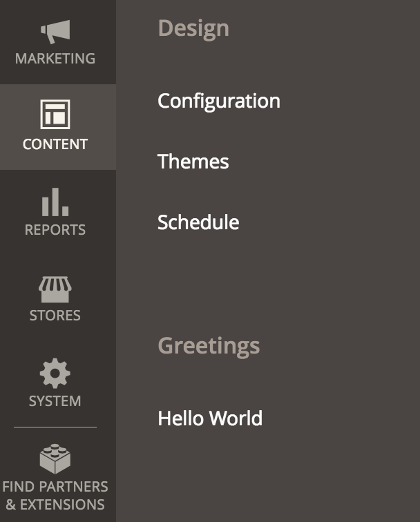
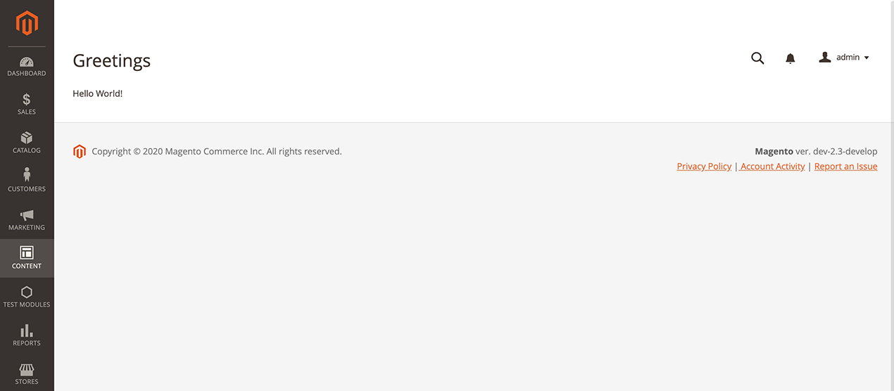

# Create an Admin page

This tutorial gives instructions for the creation of a [module](https://glossary.magento.com/module) that displays a simple page in the [Admin](https://glossary.magento.com/magento-admin).

For the purposes of this tutorial 'MyCompany' is the name of the company associated with a module named `ExampleAdminNewPage`.

## Working directory

Start by creating the working directory for all the module files.

In your development environment under the `app/code` directory, run the following command:

```bash
mkdir -p MyCompany/ExampleAdminNewPage
```

This command creates the `MyCompany` company directory and the `ExampleAdminNewPage` module directory. The latter will be the root directory for the module we will create.

## Initial boilerplate files

These initial boilerplate files are the bare essential files needed for any module.

### `composer.json`

In the module's root directory, create the file `composer.json`. This file gives [composer](https://glossary.magento.com/composer) the ability to install this module and its dependencies.
For more information see: [`composer.json`](../development/build/composer-integration.md).

 ```json
  {
    "name": "mycompany/sample-module-minimal",
    "description": "A module that creates a page in the Admin area",
    "type": "magento2-module",
    "version": "1.0.0",
    "license": [
      "OSL-3.0",
      "AFL-3.0"
    ],
    "require": {
      "php": "~7.2.0||~7.3.0"
    },
    "autoload": {
      "files": [ "registration.php" ],
      "psr-4": {
        "MyCompany\\ExampleAdminNewPage\\": ""
      }
    }
  }
 ```

### `registration.php`

In the module's root directory, create the file `registration.php`. This file registers the module `MyCompany_ExampleAdminNewPage` with the application.

For more information see: [registering your component](../development/build/component-registration.md).

```php
<?php
/**
 * Copyright © Magento, Inc. All rights reserved.
 * See COPYING.txt for license details.
 */

use Magento\Framework\Component\ComponentRegistrar;

ComponentRegistrar::register(
    ComponentRegistrar::MODULE,
    'MyCompany_ExampleAdminNewPage',
    __DIR__
);
```

### `etc/module.xml`

In the module's root directory, create a new directory called `etc`. Under that directory, create the file `module.xml`. This file specifies the name and setup version of this module.

For more information see: [naming your component](../development/build/component-name.md).

```xml
<?xml version="1.0"?>
<config xmlns:xsi="http://www.w3.org/2001/XMLSchema-instance" xsi:noNamespaceSchemaLocation="urn:magento:framework:Module/etc/module.xsd">
  <module name="MyCompany_ExampleAdminNewPage">
  </module>
</config>
```

If your module does not implement [Declarative Schema](../development/components/declarative-schema/index.md), define the `setup_version` attribute in the module element.

```xml
<module name="MyCompany_ExampleAdminNewPage" setup_version="1.0.0">
```

If your module has a dependency with other modules, you can change the loading order sequence of the module by using the `sequence` node.
In the example below, `MyCompany_ExampleAdminNewPage` will be loaded after the `Magento_Checkout` module.

```xml
<module name="MyCompany_ExampleAdminNewPage">
  <sequence>
    <module name="Magento_Checkout"/>
  </sequence>
</module>
```

## Routing and navigation

Before we can view the module's page, we need a way to navigate to it. These files create a link to the page in the left navigation and indicates how to resolve requests for that page.

For more information on this topic, see: [routing](../development/components/routing.md).

### `etc/adminhtml/menu.xml`

Under the created `etc` directory, create a new directory called `adminhtml`. Under that directory, create the file `menu.xml`. This [XML](https://glossary.magento.com/xml) file adds new menu items to the [Admin](https://glossary.magento.com/admin).

The `menu.xml` file provided below adds two items in the Content section of the left navigation:

1. A new separate section with the title **Greetings** under Content.
1. A link with the label **Hello World** that leads to a page request for `exampleadminnewpage/helloworld/index` underneath that new section.

   

The following parts make up the generated page request link to the **Hello World** page:

*  `exampleadminnewpage` - This is the `frontName`. Because its purpose is to help route requests to the correct module, we give it the same name as the module, but this is not required.
*  `helloworld` - This specifies the name of the controller to use.
*  `index` - In the XML file, since the action for the controller is not specified, the application uses the default value `index`.

[//]: # (Stop list rendering before collapsible, see: https://github.com/magento/devdocs/issues/2655)

```xml
<?xml version="1.0"?>
<config xmlns:xsi="http://www.w3.org/2001/XMLSchema-instance" xsi:noNamespaceSchemaLocation="urn:magento:module:Magento_Backend:etc/menu.xsd">
    <menu>
      <add id="MyCompany_ExampleAdminNewPage::greetings" title="Greetings" translate="title" module="MyCompany_ExampleAdminNewPage" parent="Magento_Backend::content" sortOrder="50" dependsOnModule="MyCompany_ExampleAdminNewPage" resource="MyCompany_ExampleAdminNewPage::greetings"/>
      <add id="MyCompany_ExampleAdminNewPage::greetings_helloworld" title="Hello World" translate="title" module="MyCompany_ExampleAdminNewPage" parent="MyCompany_ExampleAdminNewPage::greetings" sortOrder="10" dependsOnModule="MyCompany_ExampleAdminNewPage" action="exampleadminnewpage/helloworld" resource="MyCompany_ExampleAdminNewPage::greetings"/>
    </menu>
</config>
```

### `etc/adminhtml/routes.xml`

Under `etc/adminhtml` create the file `routes.xml`. The contents of this  XML file tells the application to route requests that use the `frontName` `exampleadminnewpage` to this module.

```xml
<?xml version="1.0"?>
<config xmlns:xsi="http://www.w3.org/2001/XMLSchema-instance" xsi:noNamespaceSchemaLocation="urn:magento:framework:App/etc/routes.xsd">
    <router id="admin">
        <route id="exampleadminnewpage" frontName="exampleadminnewpage">
            <module name="MyCompany_ExampleAdminNewPage"/>
        </route>
    </router>
</config>
```

## Page controller

Now that we have a link to the **Hello World** page, we need to create the file needed to handle that request.

### `Controller/Adminhtml/HelloWorld/Index.php`

In the module's root directory, run the following command:

```bash
mkdir -p Controller/Adminhtml/HelloWorld
```

Inside `Controller/Adminhtml/HelloWorld` directory, create the file `Index.php`. This file is the class assigned to the default Index action for the `HelloWorld` controller. Since the admin area serves this page, the file belongs in the `Adminhtml` directory, and the class itself extends [`\Magento\Backend\App\Action`](https://github.com/magento/magento2/blob/2.4}/app/code/Magento/Backend/App/Action.php).

```php
<?php
/**
 * Copyright © Magento, Inc. All rights reserved.
 * See COPYING.txt for license details.
 */

namespace MyCompany\ExampleAdminNewPage\Controller\Adminhtml\HelloWorld;

use Magento\Backend\App\Action;
use Magento\Backend\App\Action\Context;
use Magento\Framework\App\Action\HttpGetActionInterface;
use Magento\Framework\View\Result\Page;
use Magento\Framework\View\Result\PageFactory;

/**
 * Class Index
 */
class Index extends Action implements HttpGetActionInterface
{
    const MENU_ID = 'MyCompany_ExampleAdminNewPage::greetings_helloworld';

    /**
     * @var PageFactory
     */
    protected $resultPageFactory;

    /**
     * Index constructor.
     *
     * @param Context $context
     * @param PageFactory $resultPageFactory
     */
    public function __construct(
        Context $context,
        PageFactory $resultPageFactory
    ) {
        parent::__construct($context);

        $this->resultPageFactory = $resultPageFactory;
    }

    /**
     * Load the page defined in view/adminhtml/layout/exampleadminnewpage_helloworld_index.xml
     *
     * @return Page
     */
    public function execute()
    {
        $resultPage = $this->resultPageFactory->create();
        $resultPage->setActiveMenu(static::MENU_ID);
        $resultPage->getConfig()->getTitle()->prepend(__('Hello World'));

        return $resultPage;
    }
}
```

## Page view

Now that the application knows how to handle requests for the **Hello World** page, we need view files that define the look of the page.

Create the necessary directories for the files by running the following commands from the module's root directory:

```bash
mkdir -p view/adminhtml/layout
mkdir -p view/adminhtml/templates
```

These files belong in the `view/adminhtml` directory because the Admin area use these files during page generation.

### `view/adminhtml/layout/exampleadminnewpage_helloworld_index.xml`

This file defines the [layout](https://glossary.magento.com/layout) and structure of the index page for the HelloWorld controller. It sets the title to "Greetings" and assigns the `helloworld.phtml` template as the content in a `Magento\Backend\Block\Template` block class.

The name of this file uses the following pattern: *routeId*\_*controller*\_*action*.xml

```xml
<?xml version="1.0"?>
<page xmlns:xsi="http://www.w3.org/2001/XMLSchema-instance" xsi:noNamespaceSchemaLocation="urn:magento:framework:View/Layout/etc/page_configuration.xsd">
    <referenceBlock name="page.title">
        <action method="setPageTitle">
            <argument name="title" xsi:type="string">Greetings</argument>
        </action>
    </referenceBlock>
    <body>
        <referenceContainer name="content">
            <block class="Magento\Backend\Block\Template" template="MyCompany_ExampleAdminNewPage::helloworld.phtml"/>
        </referenceContainer>
    </body>
</page>
```

### `view/adminhtml/templates/helloworld.phtml`

This template file contains the actual page content for the **Hello World** page.

```html
<p>Hello World!</p>
```

## Full module directory structure

The module is now complete. Your module's directory structure under `app/code` should look like the following:

```tree
MyCompany
|-- ExampleAdminNewPage
    |
    |-- Controller
    |   |-- Adminhtml
    |       |-- HelloWorld
    |           |-- Index.php
    |-- etc
    |   |-- adminhtml
    |   |   |-- menu.xml
    |   |   |-- routes.xml
    |   |-- module.xml
    |-- view
    |   |-- adminhtml
    |       |-- layout
    |       |   |-- exampleadminnewpage_helloworld_index.xml
    |       |-- templates
    |           |-- helloworld.phtml
    |-- composer.json
    |-- registration.php
```

## Installing the module

Now that the module is code-complete, run the following commands to install it:

1. `bin/magento module:status` - This command shows a list of enabled/disabled modules.
1. `bin/magento module:enable MyCompany_ExampleAdminNewPage` - If necessary, run this to enable the disabled module.
1. `bin/magento setup:upgrade` - This command will properly register the module.
1. `bin/magento setup:di:compile` - This command compiles classes used in dependency injections.
1. `bin/magento setup:static-content:deploy` - (Production mode only) This command deploys static view files. If you are in developer mode, refer to [Clean static files cache](https://devdocs.magento.com/guides/v2.4/frontend-dev-guide/cache_for_frontdevs.html#clean_static_cache) to refresh the static view files.
1. `bin/magento cache:clean` - This command cleans the cache.

Once the module installation has completed, the link to the **Hello World** page should appear in the **Greetings** section under **Content** in the left navigation in the admin area. Clicking this link will take you to a page that looks like the one pictured below.


