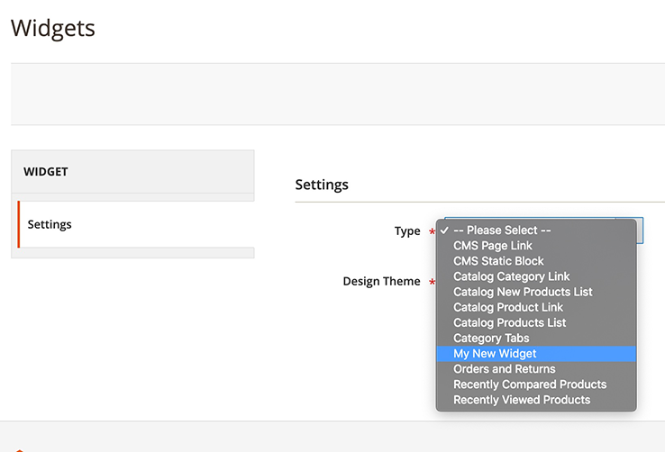
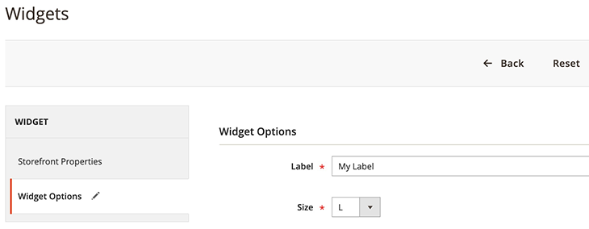
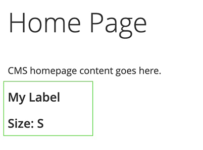

# Create a custom widget

Widgets provide powerful features that are used to add dynamic or static content to store's pages.
Here are the widgets that are available by default:

-  CMS Page Link
-  CMS Static Block
-  Catalog Category Link
-  Catalog New Products List
-  Catalog Product Link
-  Catalog Products List
-  Orders and Returns
-  Recently Compared Products
-  Recently Viewed Products

## Configuration options

| Option | Description | Type | Required |
| -------- | --------------------- | --------------------- | ---- |
| `label` | The name of the widget | String | `Yes` |
| `description` | Contains a concise explanation of the widget's purpose | String | `Yes` |
| `parameters` | A list of widget's options | Object | `No` |
| `containers` | A list of layout containers, where the widget may be injected | Object | `No` |

This tutorial shows you how to create and insert your own widget on the frontend.

## Step 1. Declaring the widget

> `etc/widget.xml`

```xml
<widgets xmlns:xsi="http://www.w3.org/2001/XMLSchema-instance"
         xsi:noNamespaceSchemaLocation="urn:magento:module:Magento_Widget:etc/widget.xsd">
    <widget class="ExampleCorp\Learning\Block\Widget\Test" id="orange_test_widget">
        <label>My New Widget</label>
        <description>This is a test widget!!!</description>
        <parameters>
            ...
        </parameters>
        <containers>
            ...
        </containers>
    </widget>
</widgets>
```

We need to also add a dependency to **Magento_Widget** in the `module.xml` file.

> `etc/module.xml`

```xml
...
<sequence>
    <module name="Magento_Widget" />
</sequence>
...
```

### Step 2. Adding widget parameters

As a parameter, we are able to use any of these field types:

-  text
-  select
-  multiselect
-  block

Add a text and a select field:

```xml
<widgets xmlns:xsi="http://www.w3.org/2001/XMLSchema-instance"
         xsi:noNamespaceSchemaLocation="urn:magento:module:Magento_Widget:etc/widget.xsd">
    <widget class="ExampleCorp\Learning\Block\Widget\Test" id="orange_test_widget">
        ...
        <parameters>
            <parameter name="title" xsi:type="text" required="true" visible="true" sort_order="10">
                <label>Label</label>
            </parameter>
            <parameter name="size" xsi:type="select" visible="true" required="true" sort_order="20">
                <label translate="true">Size</label>
                <options>
                    <option name="s" value="S">
                        <label>S</label>
                    </option>
                    <option name="m" value="M" selected="true">
                        <label>M</label>
                    </option>
                    <option name="l" value="L">
                        <label>L</label>
                    </option>
                </options>
            </parameter>
        </parameters>
    </widget>
</widgets>
```

### Step 3. Check the widget

Run the following commands to apply the module dependency declared in `module.xml`.

```bash
bin/magento module:disable Vendor_Module
```

```bash
bin/magento module:enable Vendor_Module
```

where `Vendor_Module` is replaced with the module name.

After clearing the cache, the new widget `My New Widget` should be available.



To add it to the homepage, below the page content:

After selecting the widget type and the layout location, we should be able to see the widget's options.



### Step 4. Create the block

Create the block class that we provided on the widget's initialization, responsible for
rendering it on the frontend.

> `ExampleCorp/Learning/Block/Widget/Test`

```php
namespace ExampleCorp\Learning\Block\Widget;

use Magento\Framework\View\Element\Template;
use Magento\Widget\Block\BlockInterface;

class Test extends Template implements BlockInterface
{
    protected $_template = "widget/test.phtml";
}
```

### Step 5. Create the template

And finally, create the template that will be used for showing the widget's data on the frontend.

> `ExampleCorp/Learning/view/frontend/templates/widget/test.phtml`

```php
<?php
/** @var \Magento\Framework\View\TemplateEngineInterface $this */
/** @var \ExampleCorp\Learning\Block\Widget\Test $block */
/** @var \Magento\Csp\Api\InlineUtilInterface\Proxy $csp */
/** @var \Magento\Framework\Escaper $escaper */
/** @var \Magento\Framework\Locale\LocaleFormatter $localeFormatter */
/** @var \Magento\Framework\View\Helper\SecureHtmlRenderer\Proxy $secureRenderer */
?>
<h3><?= $escaper->escapeHtml($block->getData('title')) ?></h3>
<h3><?= $escaper->escapeHtml(__('Size:')) ?> <?= $escaper->escapeHtml($block->getData('size')) ?></h3>
```

### Step 6. Clean Cache

Clean the cache with the following command:

```bash
bin/magento cache:clean
```

## Result

The widget is now shown on the frontend.


